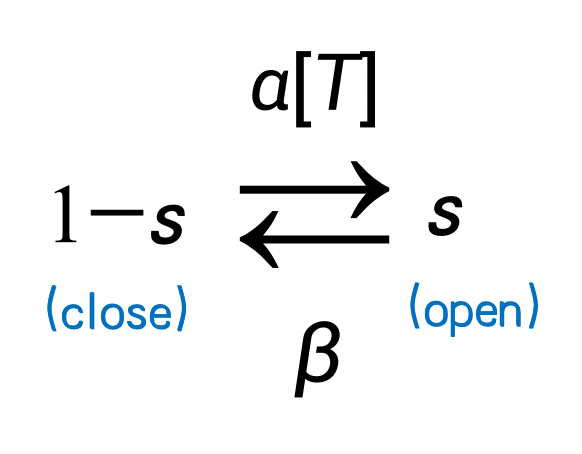
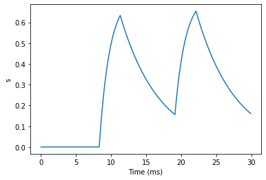
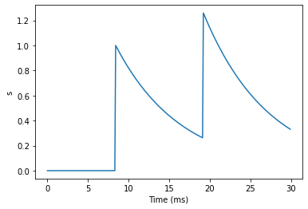

# 突触模型

## 突触动力学

当我们建模好了神经元的发放以后，就需要把这些神经元连接起来了。突触对于神经元之间的沟通十分重要，是形成网络的重要组成部分。因此，我们需要对突触进行计算建模。

我们将在这一部分介绍如何用BrainPy实现突触的动力学。

### 化学突触

#### AMPA 突触

如图所示为神经元间信息传递的生物过程。突触前神经元释放的神经递质与突触后神经元上的受体结合，从而打开突触后神经元细胞膜上的离子通道，引起膜电位的变化。这里我们首先介绍经典的带有AMPA受体的突触，然后介绍如何用BrainPy实现它。


AMPA（a-氨基-3-羟基-5-甲基-4-异恶唑丙酸）型受体是一种离子型受体，它本身就是离子通道，所以当它被神经递质结合后，会立即打开离子通道，引起突触后神经元膜电位的变化。

一个经典的模型是用马尔可夫过程来建模离子通道的开关。这里$$s$$代表通道打开的概率，$$1-s$$代表离子通道关闭的概率，$$\alpha$$和$$\beta$$是转移概率（transition probability）。由于神经递质能让离子通道打开，所以从$$1-s$$到$$s$$的转移概率受神经递质浓度影响，我们将神经递质浓度表示为[T]，得到以下的马尔可夫过程。



把该过程用微分方程描述，得到以下式子。

$$
\frac {ds}{dt} = \alpha [T] (1-s) - \beta s
$$

其中，$$\alpha [T]$$ 表示从状态$$(1-s)$$到状态$$(s)$$的转移概率；$$\beta$$ 表示从s到(1-s)的转移概率。

下面我们来看看如何用BrainPy去实现这样一个模型。首先，我们要定义一个class，因为突触是连接两个神经元的，所以这个class继承自``bp.TwoEndConn``。

定义这个class，我们首先用``__init__``函数来初始化所需的参数和变量。首先，在突触中，我们需要``pre``和``post``来分别表示这个突触所连接的突触前神经元与突触后神经元。需要注意的是，``pre``和``post``都是向量，代表两群神经元，因此，我们还需要指定两群神经元具体链接情况的``conn``。在这里，我们可以从``conn``中获得连接矩阵``conn_mat``。

现在我们知道如何在BrainPy定义一个突触模型了，接下来就重点看一下如何实现AMPA突触。我们注意到，公式中有神经递质的浓度[T]，为了简化计算，[T]可以视为常数，并由``T_duration``控制它持续的时间。因此，我们简化的实现为，每当突触前神经元发放了，会释放神经递质，递质维持``T_duration``的时间长度后即清空。因此我们只需要判断，如果此时处于``T_duration``，则[T]=T，否则[T]=0。那么判断过程则需要用``t_last_pre_spike``这个变量来记录突触前神经元最近一次发放的时间。

完成初始化后，我们把微分方程的右边抄到``derivative``这个函数里，然后在``update``函数中更新[T]和$$s$$。


```python
import brainpy as bp
bp.backend.set(backend='numpy', dt=0.1)

class AMPA(bp.TwoEndConn):
    target_backend = 'general'
    
    @staticmethod
    def derivative(s, t, TT, alpha, beta):
        ds = alpha * TT * (1 - s) - beta * s 
        return ds
    
    def __init__(self, pre, post, conn, alpha=0.98,
                 beta=0.18, T=0.5, T_duration=0.5,
                 **kwargs):
        # parameters
        self.alpha = alpha
        self.beta = beta
        self.T = T
        self.T_duration = T_duration
        
        # connections
        self.conn = conn(pre.size, post.size)
        self.conn_mat = conn.requires('conn_mat')
        self.size = bp.ops.shape(self.conn_mat)

        # variable
        self.s = bp.ops.zeros(self.size)
        self.t_last_pre_spike = -1e7 * bp.ops.ones(self.size)

        self.int_s = bp.odeint(f=self.derivative, method='exponential_euler')
        
        super(AMPA, self).__init__(pre=pre, post=post, **kwargs)
        

      
    def update(self, _t):
        spike = bp.ops.unsqueeze(self.pre.spike, 1) * self.conn_mat
        self.t_last_pre_spike = bp.ops.where(spike, _t, self.t_last_pre_spike)
        TT = ((_t - self.t_last_pre_spike) < self.T_duration) * self.T
        self.s = self.int_s(self.s, _t, TT, self.alpha, self.beta)
```

实现完后我们就可以画出$$s$$随时间变化的图。


```python
import brainmodels as bm

neu1 = bm.neurons.LIF(2, monitors=['V'])
neu2 = bm.neurons.LIF(3, monitors=['V'])
syn = AMPA(T_duration=3.,pre=neu1, post=neu2, conn=bp.connect.All2All(), monitors=['s'])

net = bp.Network(neu1, syn, neu2)
net.run(30., inputs=(neu1, 'input', 35.))
bp.visualize.line_plot(net.ts, syn.mon.s, ylabel='s', show=True)
```





由上图可以看到当突触前神经元发放后，$$s$$的值会先增加，然后decay。

#### 指数及Alpha突触模型

由于许多突触模型都有类似AMPA突触那样先上升后下降的动力学特征，有时候我们建模不需要具体对应到生物学上的突触，因此，有人提出了一些抽象的突触模型。这里，我们会介绍四种这类抽象模型在BrainPy上的实现。这些模型在``Brain-Models``中也有现成的提供。

##### (1) 双指数差（Differences of two exponentials）

我们首先来看双指数差（Differences of two exponentials）模型，它的公式如下：

$$
s = \frac {\tau_1 \tau_2}{\tau_1 - \tau_2} (\exp(-\frac{t - t_s}{\tau_1})
- \exp(-\frac{t - t_s}{\tau_2}))
$$


在BrainPy的实现中，我们采用以下微分方程形式：

$$
		\frac {ds} {dt} = x
$$

$$
\frac {dx}{dt} =- \frac{\tau_1+\tau_2}{\tau_1 \tau_2}x - \frac s {\tau_1 \tau_2}
$$

$$
\text{if (fire), then} \ x \leftarrow x+ 1
$$


这里我们把判断当突触前神经元有发放时，$$x$$增加的逻辑写到``update``函数中。代码如下：


```python
class Two_exponentials(bp.TwoEndConn):
    target_backend = 'general'

    @staticmethod
    def derivative(s, x, t, tau1, tau2):
        dxdt = (-(tau1 + tau2) * x - s) / (tau1 * tau2)
        dsdt = x
        return dsdt, dxdt
    
    def __init__(self, pre, post, conn, tau1=1.0, tau2=3.0, **kwargs):
        # parameters
        self.tau1 = tau1
        self.tau2 = tau2

        # connections
        self.conn = conn(pre.size, post.size)
        self.conn_mat = conn.requires('conn_mat')
        self.size = bp.ops.shape(self.conn_mat)

        # variables
        self.s = bp.ops.zeros(self.size)
        self.x = bp.ops.zeros(self.size)

        self.integral = bp.odeint(f=self.derivative, method='rk4')
        
        super(Two_exponentials, self).__init__(pre=pre, post=post, **kwargs)
    
    def update(self, _t):
        self.s, self.x = self.integral(self.s, self.x, _t, self.tau1, self.tau2)
        self.x += bp.ops.unsqueeze(self.pre.spike, 1) * self.conn_mat
```


```python
neu1 = bm.neurons.LIF(2, monitors=['V'])
neu2 = bm.neurons.LIF(3, monitors=['V'])
syn = Two_exponentials(tau1=2., pre=neu1, post=neu2, conn=bp.connect.All2All(), monitors=['s'])

net = bp.Network(neu1, syn, neu2)
net.run(30., inputs=(neu1, 'input', 35.))
bp.visualize.line_plot(net.ts, syn.mon.s, ylabel='s', show=True)
```


##### (2) Alpha突触

Alpha突触和上述模型类似，唯独在这里$$\tau_1 = \tau_2$$，因此公式更加简化了：

$$
\frac {ds} {dt} = x
$$

$$
 \frac {dx}{dt} =- \frac{2x}{\tau} - \frac s {\tau^2}
$$

$$
\text{if (fire), then} \ x \leftarrow x+ 1
$$

代码实现也类似：


```python
class Alpha(bp.TwoEndConn):
    target_backend = 'general'

    @staticmethod
    def derivative(s, x, t, tau):
        dxdt = (-2 * tau * x - s) / (tau ** 2)
        dsdt = x
        return dsdt, dxdt
    
    def __init__(self, pre, post, conn, tau=3.0, **kwargs):
        # parameters
        self.tau = tau

        # connections
        self.conn = conn(pre.size, post.size)
        self.conn_mat = conn.requires('conn_mat')
        self.size = bp.ops.shape(self.conn_mat)

        # variables
        self.s = bp.ops.zeros(self.size)
        self.x = bp.ops.zeros(self.size)

        self.integral = bp.odeint(f=self.derivative, method='rk4')
        
        super(Alpha, self).__init__(pre=pre, post=post, **kwargs)
    
    def update(self, _t):
        self.s, self.x = self.integral(self.s, self.x, _t, self.tau)
        self.x += bp.ops.unsqueeze(self.pre.spike, 1) * self.conn_mat
```


```python
neu1 = bm.neurons.LIF(2, monitors=['V'])
neu2 = bm.neurons.LIF(3, monitors=['V'])
syn = Alpha(pre=neu1, post=neu2, conn=bp.connect.All2All(), monitors=['s'])

net = bp.Network(neu1, syn, neu2)
net.run(30., inputs=(neu1, 'input', 35.))
bp.visualize.line_plot(net.ts, syn.mon.s, ylabel='s', show=True)
```


##### (3) 单指数衰减（Single exponential decay）

有时候在建模中可以忽略上升的过程，而只需要建模衰退（decay）的过程。这种模型称为单指数衰减（Single exponential decay）模型，其公式就更加简化了：

$$
\frac {ds}{dt}=-\frac s {\tau_{decay}}
$$

$$
\text{if (fire), then} \ s \leftarrow s+1
$$

代码实现如下：


```python
class Exponential(bp.TwoEndConn):
    target_backend = 'general'

    @staticmethod
    def derivative(s, t, tau):
        ds = -s / tau
        return ds
    
    def __init__(self, pre, post, conn, tau=8.0, **kwargs):
        # parameters
        self.tau = tau

        # connections
        self.conn = conn(pre.size, post.size)
        self.conn_mat = conn.requires('conn_mat')
        self.size = bp.ops.shape(self.conn_mat)

        # variables
        self.s = bp.ops.zeros(self.size)
        
        self.integral = bp.odeint(f=self.derivative, method='exponential_euler')
        
        super(Exponential, self).__init__(pre=pre, post=post, **kwargs)


    def update(self, _t):
        self.s = self.integral(self.s, _t, self.tau)
        self.s += bp.ops.unsqueeze(self.pre.spike, 1) * self.conn_mat
```


```python
neu1 = bm.neurons.LIF(2, monitors=['V'])
neu2 = bm.neurons.LIF(3, monitors=['V'])
syn = Exponential(pre=neu1, post=neu2, conn=bp.connect.All2All(), monitors=['s'])

net = bp.Network(neu1, syn, neu2)
net.run(30., inputs=(neu1, 'input', 35.))
bp.visualize.line_plot(net.ts, syn.mon.s, ylabel='s', show=True)
```





##### （4）电压跳变（Voltage jump）

建模上，有时候甚至连衰退的过程也可以忽略，这样的模型成为电压跳变（Voltage jump）模型，公式如下：

$$
\text{if (fire), then} \ V \leftarrow V+1
$$

在实现上，连微分方程都不需要了，只需要在``update``函数中更新突触后膜的膜电位。但是，由于更新的是膜电位，因此要主要当突触后神经元为LIF等具有不应期的神经元时，不应期的时候不会改变膜电位。代码如下：


```python
class Voltage_jump(bp.TwoEndConn):        
    target_backend = 'general'

    def __init__(self, pre, post, conn, post_refractory=False,  **kwargs):
        # parameters
        self.post_refractory = post_refractory

        # connections
        self.conn = conn(pre.size, post.size)
        self.conn_mat = conn.requires('conn_mat')
        self.size = bp.ops.shape(self.conn_mat)

        # variables
        self.s = bp.ops.zeros(self.size)
        
        super(Voltage_jump, self).__init__(pre=pre, post=post, **kwargs)
    
    def update(self, _t):
        self.s = bp.ops.unsqueeze(self.pre.spike, 1) * self.conn_mat
             
        if self.post_refractory:
            refra_map = (1. - bp.ops.unsqueeze(self.post.refractory, 0)) * self.conn_mat
            self.post.V += bp.ops.sum(self.s * refra_map, axis=0)
        else:
            self.post.V += bp.ops.sum(self.s, axis=0)
```


```python
neu1 = bm.neurons.LIF(2, monitors=['V'])
neu2 = bm.neurons.LIF(3, monitors=['V'])
syn = Voltage_jump(pre=neu1, post=neu2, conn=bp.connect.All2All(), monitors=['s'])

net = bp.Network(neu1, syn, neu2)
net.run(30., inputs=(neu1, 'input', 35.))
bp.visualize.line_plot(net.ts, syn.mon.s, ylabel='s', show=True)
```


#### 基于电流的和基于电导的突触

前面我们已经建模了门控变量$$s$$。有两种不同的方法来建模从$$s$$到突触电流$$I$$（即突触后神经元的输入电流）的关系，分别为
**基于电流的（current-based）**
与**基于电导的（conductance-based）**。两者的主要区别在于突触电流是否受突触后神经元膜电位的影响。

基于电流的模型公式如下：

$$
I \propto s
$$

在代码实现上，我们通常会乘上一个权重$$w$$，我们可以通过调整权重的正负值来实现兴奋性和抑制性突触。

这里还通过使用BrainPy提供的``register_constant_delay``函数给变量``I_ syn``加上延迟时间来实现突触的延迟。


```python
def __init__(self, pre, post, conn, **kwargs):
    # ...
    self.s = bp.ops.zeros(self.size)
    self.w = bp.ops.ones(self.size) * .2
    self.I_syn = self.register_constant_delay('I_syn', size=self.size, delay_time=delay)

def update(self, _t):
    for i in nb.prange(self.size):
        # ... 
        self.I_syn.push(i, self.w[i] * self.s[i])
        self.post.input[post_id] += self.I_syn.pull(i) 
```

在基于电导的模型中，电导为$$g=\bar{g}s$$。因此，根据欧姆定律得公式如下：

$$
I=\bar{g}s(V-E)
$$

这里$$E$$是一个反转电位（reverse potential），它可以决定$$I$$的方向是抑制还是兴奋。例如，当静息电位约为-65时，减去比它更低的$$E$$，例如-75，将变为正，从而改变公式中电流的方向并产生抑制电流。兴奋性突触的$$E$$一般为比较高的值，如0。

代码实现上，可以把延迟时间应用到变量``g``上。


```python
def __init__(self, pre, post, conn, g_max, E, **kwargs):
    self.g_max = g_max
    self.E = E
    # ...
    self.s = bp.ops.zeros(self.size)
    self.g = self.register_constant_delay('g', size=self.size, delay_time=delay)

def update(self, _t):
    for i in nb.prange(self.size):
        # ...
        self.g.push(i, self.g_max * self.s[i])
        self.post.input[post_id] -= self.g.pull(i) * (self.post.V[post_id] - self.E)
```

### 电突触（缝隙连接 Gap junction）

除了前面介绍的化学突触以外，电突触在我们神经系统中也很常见。


如上图，两个神经元通过连接通道 (junction channels) 相连，可以直接导电。因此，可以看作是两个神经元由一个常数电阻连起来，如下图所示。


根据欧姆定律可得以下公式。

$$
I_{1} = w (V_{0} - V_{1})
$$

这里电导表示为$$w$$，它表示连接的权重。

在BrainPy的实现中，只需要在``update``函数里更新即可。


```python
class Gap_junction(bp.TwoEndConn):
    target_backend = 'general'

    def __init__(self, pre, post, conn, delay=0., k_spikelet=0.1, post_refractory=False,  **kwargs):
        self.delay = delay
        self.k_spikelet = k_spikelet
        self.post_refractory = post_refractory

        # connections
        self.conn = conn(pre.size, post.size)
        self.conn_mat = conn.requires('conn_mat')
        self.size = bp.ops.shape(self.conn_mat)

        # variables
        self.w = bp.ops.ones(self.size)
        self.spikelet = self.register_constant_delay('spikelet', size=self.size, delay_time=delay)

        super(Gap_junction, self).__init__(pre=pre, post=post, **kwargs)

    def update(self, _t):
        v_post = bp.ops.vstack((self.post.V,) * self.size[0])
        v_pre = bp.ops.vstack((self.pre.V,) * self.size[1]).T

        I_syn = self.w * (v_pre - v_post) * self.conn_mat
        self.post.input += bp.ops.sum(I_syn, axis=0)

        self.spikelet.push(self.w * self.k_spikelet * bp.ops.unsqueeze(self.pre.spike, 1) * self.conn_mat)

        if self.post_refractory:
            self.post.V += bp.ops.sum(self.spikelet.pull(), axis=0) * (1. - self.post.refractory)
        else:
            self.post.V += bp.ops.sum(self.spikelet.pull(), axis=0)
```


```python
import matplotlib.pyplot as plt
import numpy as np

neu0 = bm.neurons.LIF(2, monitors=['V'], t_refractory=0)
neu0.V = np.ones(neu0.V.shape) * -10.
neu1 = bm.neurons.LIF(3, monitors=['V'], t_refractory=0)
neu1.V = np.ones(neu1.V.shape) * -10.
syn = Gap_junction(pre=neu0, post=neu1, conn=bp.connect.All2All(),
                    k_spikelet=5.)
syn.w = np.ones(syn.w.shape) * .5

net = bp.Network(neu0, neu1, syn)
net.run(100., inputs=(neu0, 'input', 30.))

fig, gs = bp.visualize.get_figure(row_num=2, col_num=1, )

fig.add_subplot(gs[1, 0])
plt.plot(net.ts, neu0.mon.V[:, 0], label='V0')
plt.legend()

fig.add_subplot(gs[0, 0])
plt.plot(net.ts, neu1.mon.V[:, 0], label='V1')
plt.legend()
plt.show()
```


