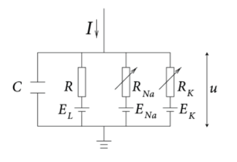
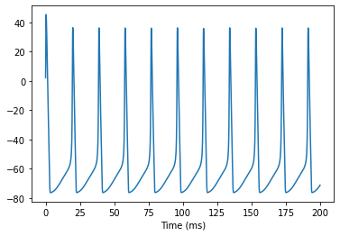

## 1.2 Biophysical models

### 1.2.1 Hodgkin-Huxley model

Hodgkin and Huxley (1952) recorded the generation of action potential on squid giant axons with voltage clamp technique, and proposed the canonical neuron model called **Hudgin-Huxley model** (**HH model**). 

In last section we have introduced a general template for neuron membrane. Computational neuroscientists always model neuron membrane as equivalent circuit like the following figure.

	

<b>Fig. 1-4 Equivalent circuit diagram | NeuroDynamics </b>

The equivalent circuit diagram of Fig.1-1 is shown in Fig. 1-4, in which the patch of neuron membrane is converted into electric components. In Fig.1-4, the capacitance $$C$$ refers to the hydrophobic phospholipid bilayer with low conductance, and current $$I$$ refers to the external stimulus.

As Na+ ion channel and K+ ion channel are important in the generation of action potentials, these two ion channels are modeled as the two variable resistances $$R_{Na}$$ and $$R_K$$ in parallel on the right side of the circuit diagram, and the resistance $$R$$ refers to all the non-specific ion channels on the membrane. The batteries $$E_{Na}$$, $$E_K$$ and $E_L$ refer to the electric potential differences caused by the concentration differences of corresponding ions.

Consider the Kirchhoff’s first law, that is,  for any node in an electrical circuit, the sum of currents flowing into that node is equal to the sum of currents flowing out of that node, Fig. 1-2 can be modeled as differential equations:
$$
C \frac{dV}{dt} = -(\bar{g}_{Na} m^3 h (V - E_{Na}) + \bar{g}_K n^4(V - E_K) + g_{leak}(V - E_{leak})) + I(t)
$$

$$
\frac{dx}{dt} = \alpha_x(1-x) - \beta_x , x \in \{ Na, K, leak \}
$$

That is the HH model. Note that in the first equation above, the first three terms on the right hand are the current go through Na+ ion channels, K+ ion channels and other non-specific ion channels, respectively, while $$I(t)$$ is an external input. On the left hand, $$C\frac{dV}{dt} = \frac{dQ}{dt} = I$$ is the current go through the capacitance. 

In the computing of ion channel currents, other than the Ohm's law $$I = U/R = gU$$, HH model introduces three **gating variables** m, n and h to control the open/close state of ion channels. To be precise, variables m and h control the state of Na+ ion channel, variable n controls the state of K+ ion channel, and the real conductance of an ion channel is the product of maximal conductance $$\bar{g}$$ and the state of gating variables. Gating variables' dynamics can be expressed in a Markov-like form, in which $$\alpha_x$$ refers to the activation rate of gating variable x, and $$\beta_x$$ refers to the de-activation rate of x. The expressions of $$\alpha_x$$ and $$\beta_x$$ (as shown in equations below) are fitted by experimental data.
$$
\alpha_m(V) = \frac{0.1(V+40)}{1 - exp(\frac{-(V+40)}{10})}
$$

$$
\beta_m(V) = 4.0 exp(\frac{-(V+65)}{18})
$$

$$
\alpha_h(V) = 0.07 exp(\frac{-(V+65)}{20})
$$

$$
\beta_h(V) = \frac{1}{1 + exp(\frac{-(V + 35)}{10})}
$$

$$
\alpha_n(V) = \frac{0.01(V+55)}{1 - exp(\frac{-(V+55)}{10})}
$$

$$
\beta_n(V) = 0.125 exp(\frac{-(V+65)}{80})
$$

*Run codes in our github repository: https://github.com/PKU-NIP-Lab/BrainModels*

The V-t plot of HH model simulated by BrainPy is shown below. The three periods, depolarization, repolarization and refractory period of a real action potential can be seen in the V-t plot. In addition, during the depolarization period, the membrane integrates external inputs slowly at first, and increases rapidly once it grows beyond some point, which also reproduces the "shape" of action potentials.

