## 1.3 Reduced models

Inspired by biophysical experiments, Hodgkin-Huxley model is precise but costly. Researchers proposed the reduced models to reduce the consumption on computing resources and running time in simulation. 

These models are simple and easy to compute, while they can still reproduce the main pattern of neuron behaviors. Although their representation capabilities are not as good as biophysical models, such a loss of accuracy is sometimes acceptable considering their simplicity.

### 1.3.1 Leaky Integrate-and-Fire model

The most typical reduced model is the **Leaky Integrate-and-Fire model** (**LIF model**) presented by Lapicque (1907).  LIF model is a combination of integrate process represented by differential equation and spike process represented by conditional judgment:

$$
\tau\frac{dV}{dt} = - (V - V_{rest}) + R I(t)
$$
If  $$V > V_{th}$$, neuron fires, 
$$
V \gets V_{reset}
$$
$$\tau = RC$$ is the time constant of LIF model, the larger $$\tau$$ is, the slower model dynamics is. The equation shown above is corresponding to a simpler equivalent circuit than HH model, for it does not model the Na+ and K+ ion channels any more. Actually, in LIF model, only the consistence $$R$$, capacitance $$C$$, battery $$E$$ and external input $$I$$ is modeled.

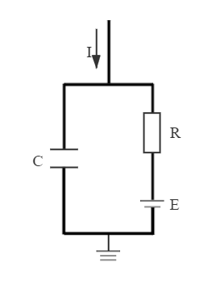

<b>Fig1-4 Equivalent circuit of LIF model</b>

Compared with HH model, LIF model does not model the shape of action potentials, which means, the membrane potential does not burst before a spike. Also the refractory period is overlooked in the original model, and in order to generate it, another conditional judgment must be added:

If 
$$
t-t_{last spike}<=refractory period
$$
then neuron is in refractory period, membrane potential $$V$$ will not be updated.

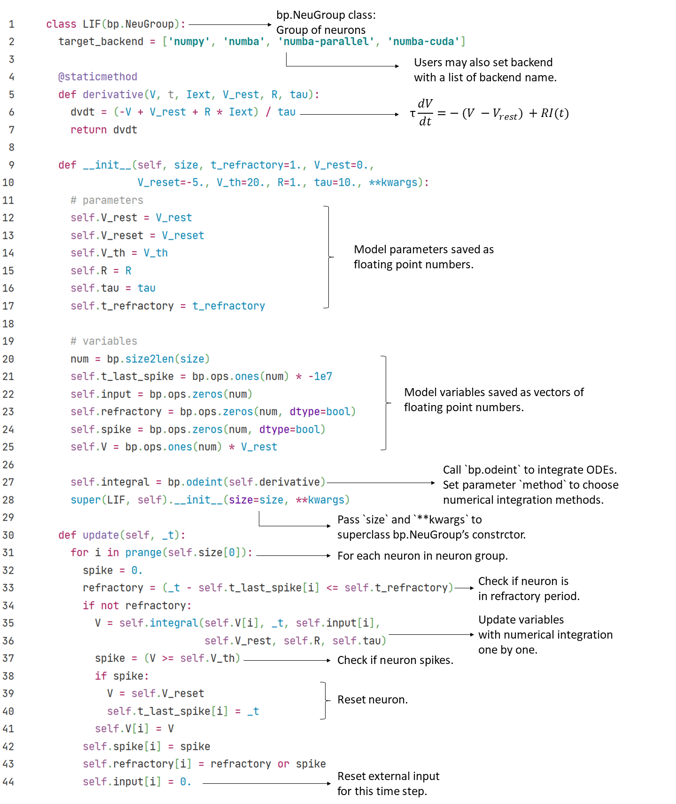

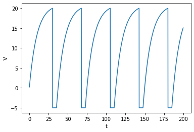

### 1.3.2 Quadratic Integrate-and-Fire model

To pursue higher representation capability, Latham et al. (2000) proposed **Quadratic Integrate-and-Fire model** (**QuaIF model**), in which they add a second order term in differential equation so the neurons can generate spike better.

$$
\tau\frac{d V}{d t}=a_0(V-V_{rest})(V-V_c) + RI(t)
$$

In the equation above, $$a_0$$ is a special parameter controls the slope of membrane potential before a spike, and $$V_c$$ is the critical potential for action potential initialization. Below $$V_C$$, membrane potential $$V$$ increases slowly, once it grows beyond $$V_c$$, $$V$$ turns to rapid increase.

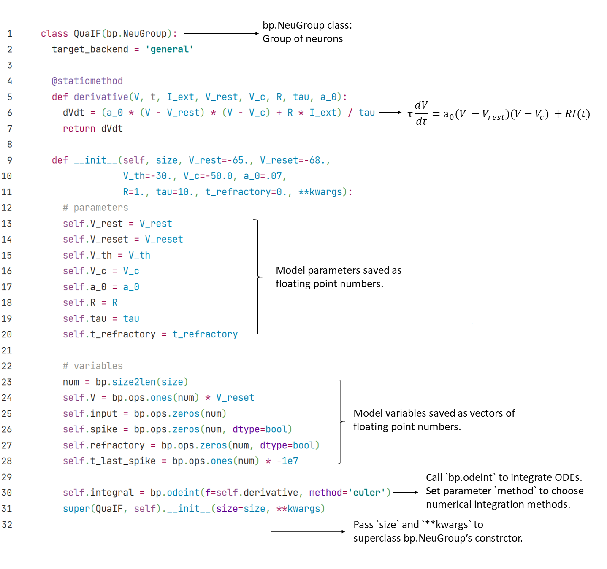

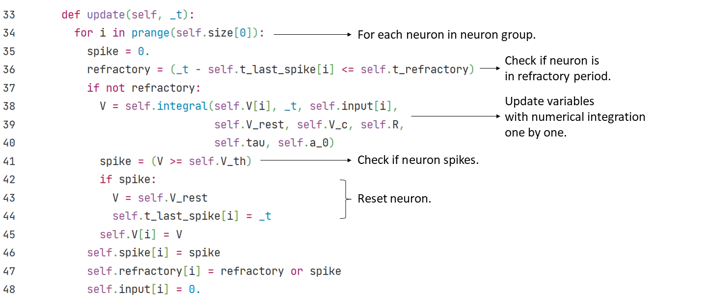

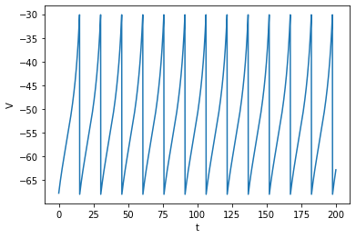

### 1.3.3 Exponential Integrate-and-Fire model
**Exponential Integrate-and-Fire model** (**ExpIF model**) (Fourcaud-Trocme et al., 2003) is more expressive than QuaIF model. With the exponential term added to the right hand of differential equation, the dynamics of ExpIF model can now generates a more realistic action potential.
$$
\tau \frac{dV}{dt} = - (V - V_{rest}) + \Delta_T e^{\frac{V - V_T}{\Delta_T}} + R I(t)
$$

In the exponential term, $$V_T$$ is the critical potential of generating action potential, below which $$V$$ increases slowly and above which rapidly. $$\Delta_T$$ is the slope of action potentials in ExpIF model, and when $$\Delta_T\to 0$$, the shape of spikes in ExpIF model will be equivalent to the LIF model with $$V_{th} = V_T$$(Fourcaud-Trocme et al., 2003) .

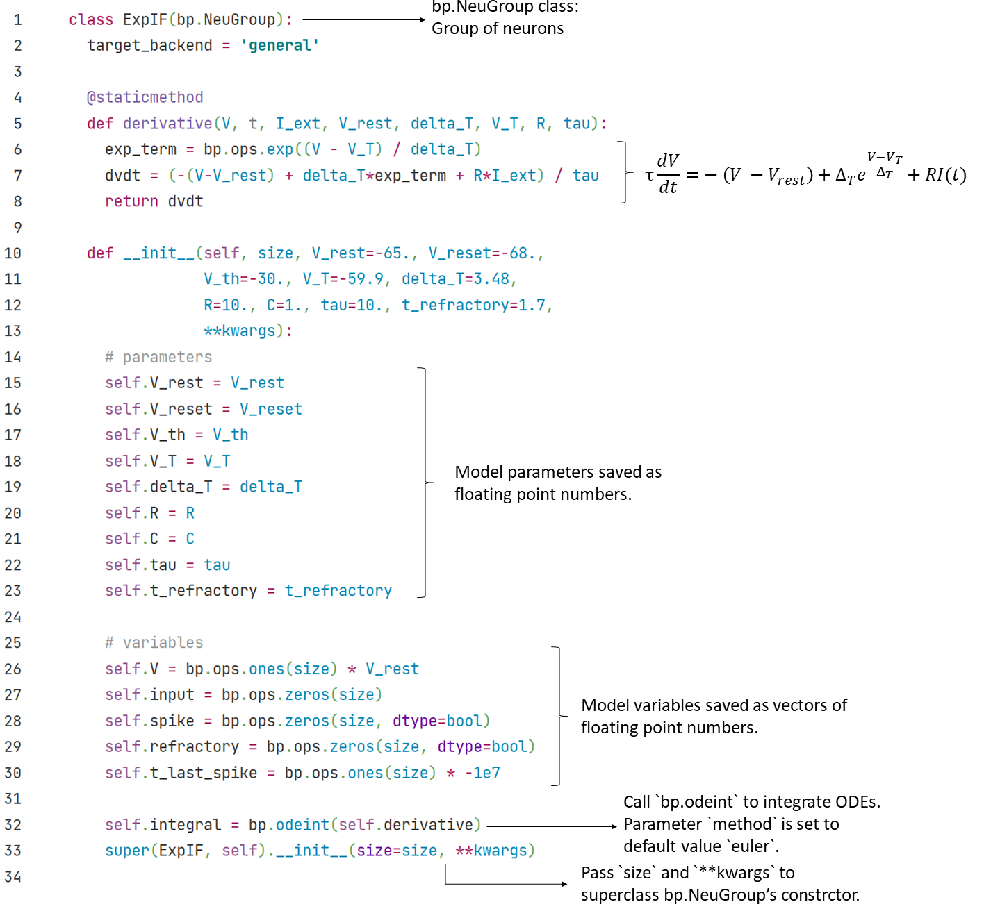

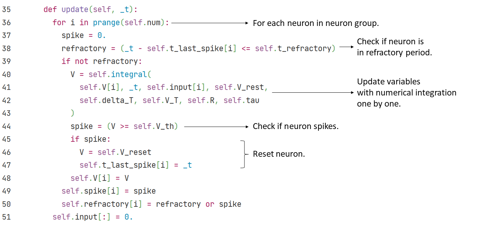

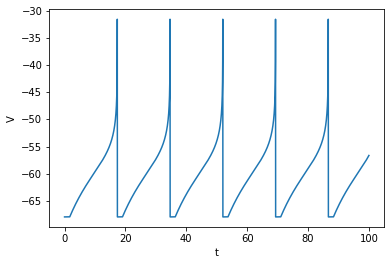

### 1.3.4 Adaptive Exponential Integrate-and-Fire model

While facing a constant stimulus, the response generated by a single neuron will sometimes decreases over time, this phenomenon is called **adaptation** in biology.

To reproduce the adaptation behavior of neurons, researchers add a weight variable $$w$$ to existing integrate-and-fire models like LIF, QuaIF and ExpIF models. Here we introduce a typical one: **Adaptive Exponential Integrate-and-Fire model** (**AdExIF model**)(Gerstner et al, 2014).
$$
\tau_m \frac{dV}{dt} = - (V - V_{rest}) + \Delta_T e^{\frac{V - V_T}{\Delta_T}} - R w + R I(t)
$$

$$
\tau_w \frac{dw}{dt} = a(V - V_{rest})- w + b \tau_w \sum \delta(t - t^f))
$$

The first differential equation of AdExIF model, as the model name shows, is similar to ExpIF model we introduced above, except for the term of adaptation, which is shown as $$-Rw$$ in the equation.

The weight term $$w$$ is regulated by the second differential equation. $$a$$ describes the sensitivity of the recovery variable $$w$$ to the sub-threshold fluctuations of $$V$$, and $$b$$ is the increment value of $$w$$ generated by a spike, and $$w$$ will also decay over time. 

Give AdExIF neuron a constant input, after several spikes, the value of $$w$$ will increase to a high value, which slows down the rising speed of $$V$$, thus reduces the neuron's firing rate.

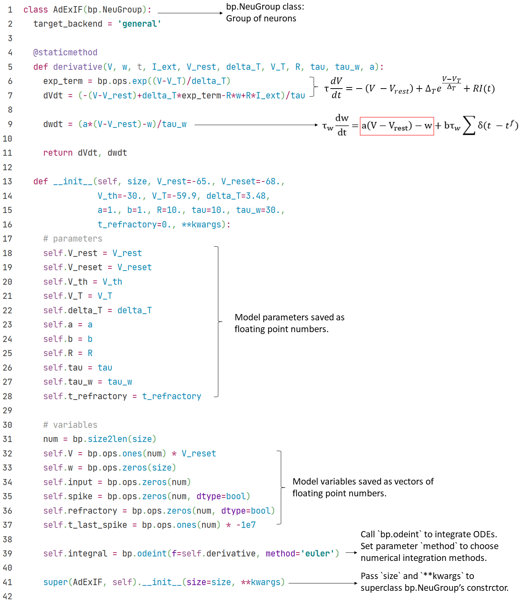

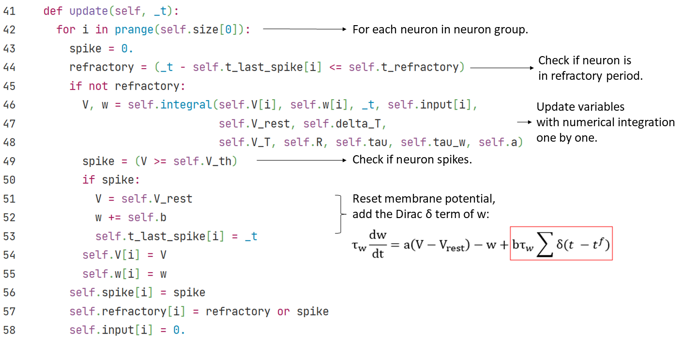

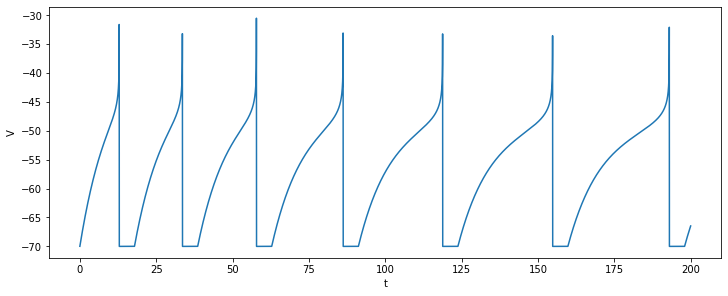

### 1.3.5 Hindmarsh-Rose model

To simulate the bursting spike pattern in neurons (i.e. continuously firing in a short time period), Hindmarsh and Rose (1984) proposed **Hindmarsh-Rose model**, import a third model variable $$z$$ as slow variable to control the bursting of neuron.

$$
\frac{d V}{d t} = y - a V^3 + b V^2 - z + I
$$

$$
\frac{d y}{d t} = c - d V^2 - y
$$

$$
\frac{d z}{d t} = r (s (V - V_{rest}) - z)
$$

The $$V$$ variable refers to membrane potential, and $$y$$, $$z$$ are two gating variables. The parameter $$b$$ in $$\frac{dV}{dt}$$ equation allows the model to switch between spiking and bursting states, and controls the spiking frequency. $$r$$ controls slow variable $$z$$'s variation speed, affects the number of spikes per burst when bursting, and governs the spiking frequency together with $$b$$. The parameter $$s$$ governs adaptation, and other parameters are fitted by firing patterns.

	

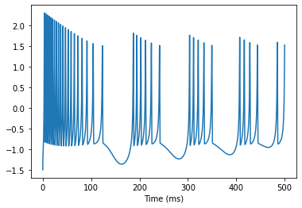

In the variable-t plot painted below, we may see that the slow variable $$z$$ change much slower than $$V$$ and $$y$$. Also, $$V$$ and $$y$$ are changing periodically during the simulation.

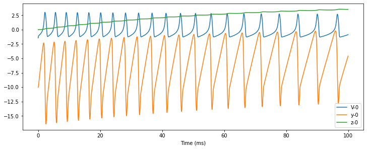

With the theoretical analysis module `analysis` of BrainPy, we may explain the existence of this periodicity through theoretical analysis. In Hindmarsh-Rose model, the trajectory of $$V$$ and $$y$$ approaches a limit cycle in phase plane, therefore their values change periodically along the limit cycle.

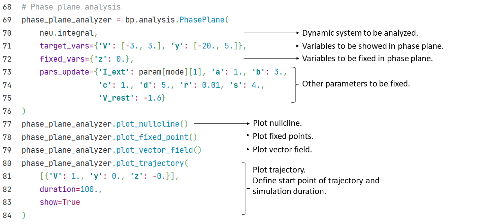

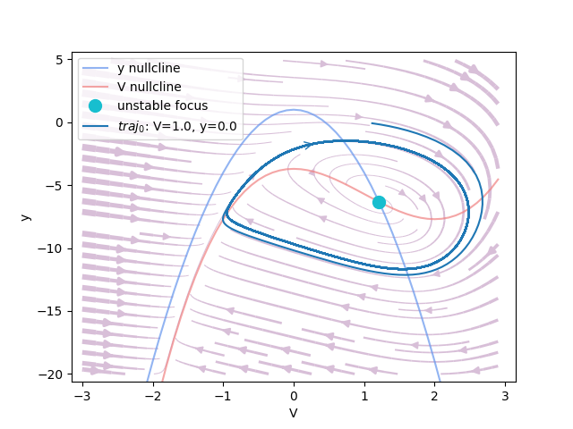

### 1.3.6 Generalized Integrate-and-Fire model

**Generalized Integrate-and-Fire model** (**GIF model**)(Mihalaş et al., 2009) integrates several firing patterns in one model. With 4 model variables, it can generate more than 20 types of firing patterns, and is able to alternate between patterns by fitting parameters.
$$
\frac{d I_j}{d t} = - k_j I_j, j = {1, 2}
$$

$$
\tau \frac{d V}{d t} = ( - (V - V_{rest}) + R\sum_{j}I_j + RI)
$$

$$
\frac{d V_{th}}{d t} = a(V - V_{rest}) - b(V_{th} - V_{th\infty})
$$

When V meets Vth, Generalized IF neuron fire:

$$
I_j \leftarrow R_j I_j + A_j
$$

$$
V \leftarrow V_{reset}
$$

$$
V_{th} \leftarrow max(V_{th_{reset}}, V_{th})
$$

In the $$\frac{dV}{dt} $$ differential equation, just like all the integrate-and-fire models, $$\tau$$ is time constant, $$V$$ is membrane potential, $$V_{rest}$$ is resting potential, $$R$$ is conductance, and $$I$$ is external input. 

However, in GIF model, variable amounts of internal currents are added to the equation, shown as the $$\sum_j I_j$$ term. Each $$ I_j $$ is an internal current in the neuron, with a decay rate of $$k_j$$.  $$R_j$$ and $$A_j$$ are free parameters, $$R_j$$ describes the dependence of $$I_j$$ reset value on the value of $$I_j$$ before spike, and $$A_j$$ is a constant value added to the reset value after spike.

The variable threshold potential $$V_{th}$$ is regulated by two parameters: $$a$$ describes the dependence of $$V_{th}$$ on the membrane potential $$V$$, and $$b$$ is the rate $$V_{th}$$ approaches the infinite value of threshold $$V_{th_{\infty}}$$. $$V_{th_{reset}}$$ is the reset value of threshold potential when neuron fires.

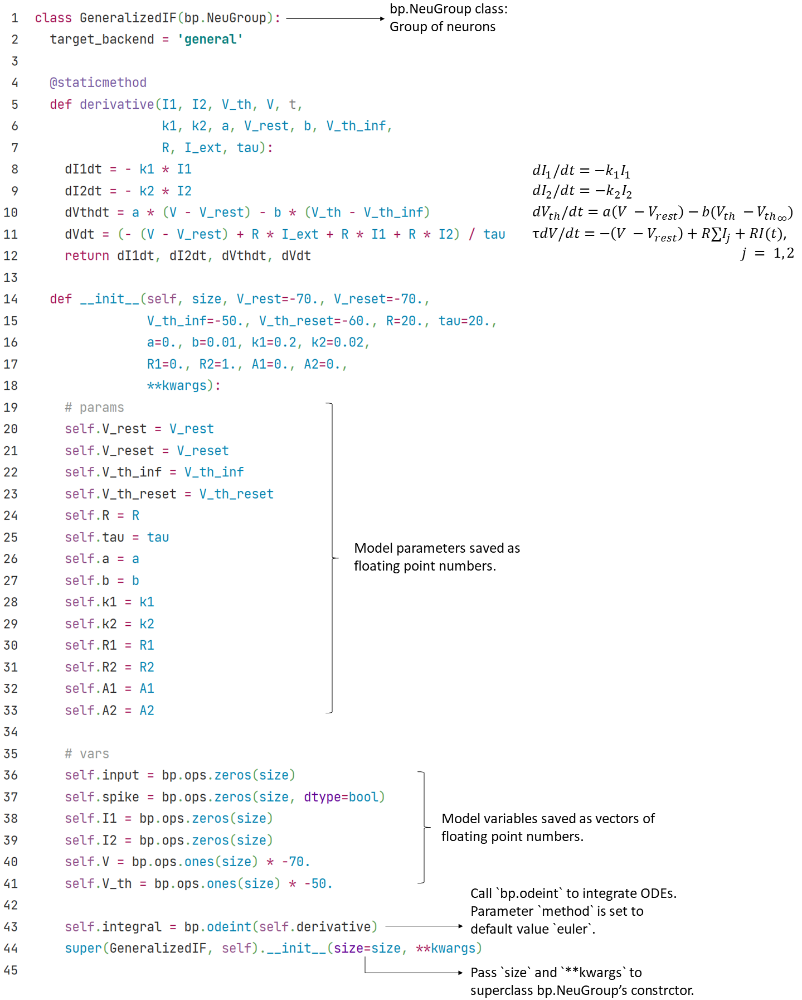	

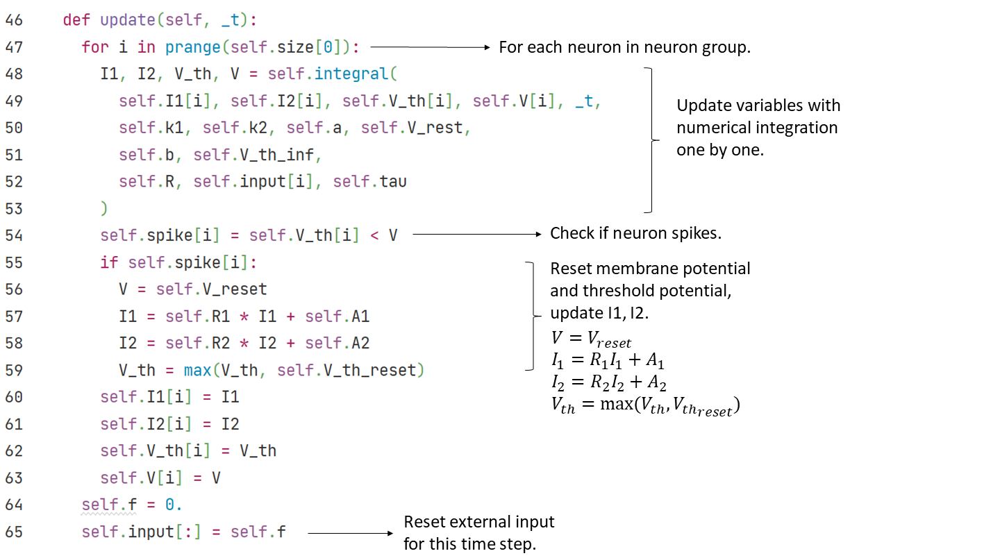	

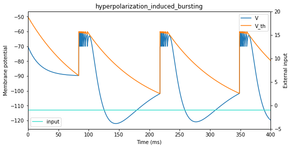

