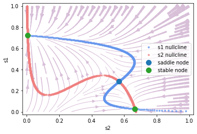

## 发放率网络 Firing rate networks

### 决择模型

除了脉冲模型以外，BrainPy同样也可以实现发放率模型（Firing rate models）。我们首先来看看前述抉择模型的简化版本的实现。该模型由研究者（Wong & Wang, 2006）通过平均场方法（mean-field approach）等一系列手段简化得出，最终只剩下两个变量，$$S_1$$和$$S_2$$，分别表示两群神经元的状态，同时也分别对应着两个选项。


公式如下：

$$
\frac{dS_1} {dt} = -\frac {S_1} \tau + (1-S_1) \gamma r_1
$$

$$
\frac{dS_2} {dt} = -\frac {S_2} \tau + (1-S_2) \gamma r_2
$$

其中 $$r_1$$ 和 $$r_2$$ 分别为两群神经元的发放率，由输入-输出函数（input-output function）给出，为：

$$
r_i = f(I_{syn, i})
$$

$$
f(I)= \frac {aI-b} {1- \exp [-d(aI-b)]}
$$

$$I_{syn, i}$$ 的公式由模型结构给出，为自身的循环（recurrent）连接减去对方传来的抑制电流，并加上背景电流及外界输入，可得：

$$
I_{syn, 1} = J_{11} S_1 - J_{12} S_2 + I_0 + I_1
$$

$$
I_{syn, 2} = J_{22} S_2 - J_{21} S_1 + I_0 + I_2
$$


而外界输入 $$I_1, I_2$$ 则由总输入的强度 $$\mu_0$$ 及一致性（coherence） $$c'$$ 决定。一致性越高，则越明确$$S_1$$是正确答案，而一致性越低则表示越随机。公式如下：

$$
I_1 = J_{\text{A, ext}} \mu_0 (1+\frac {c'}{100\%})
$$

$$
I_2 = J_{\text{A, ext}} \mu_0 (1-\frac {c'}{100\%})
$$


代码实现如下，我们可以创建一个神经元群的类（``bp.NeuGroup``），并用$$S_1$$及$$S_2$$分别储存这群神经元的两个状态。该模型的动力学部分可以由一个``derivative``函数实现，以便进行动力学分析。


```python
class Decision(bp.NeuGroup):
    target_backend = 'general'

    @staticmethod
    def derivative(s1, s2, t, I, coh, JAext, J_rec, J_inh, I_0, b, d, a, tau_s, gamma):
        I1 = JAext * I * (1. + coh)
        I2 = JAext * I * (1. - coh)

        I_syn1 = J_rec * s1 - J_inh * s2 + I_0 + I1
        r1 = (a * I_syn1 - b) / (1. - bp.ops.exp(-d * (a * I_syn1 - b)))
        ds1dt = - s1 / tau_s + (1. - s1) * gamma * r1

        I_syn2 = J_rec * s2 - J_inh * s1 + I_0 + I2
        r2 = (a * I_syn2 - b) / (1. - bp.ops.exp(-d * (a * I_syn2 - b)))
        ds2dt = - s2 / tau_s + (1. - s2) * gamma * r2

        return ds1dt, ds2dt

    def __init__(self, size, coh, tau_s=.06, gamma=0.641,
                 J_rec=.3725, J_inh=.1137,
                 I_0=.3297, JAext=.00117,
                 a=270., b=108., d=0.154,
                 **kwargs):
        # parameters
        self.coh = coh
        self.tau_s = tau_s
        self.gamma = gamma
        self.J_rec = J_rec
        self.J_inh = J_inh
        self.I0 = I_0
        self.JAext = JAext
        self.a = a
        self.b = b
        self.d = d

        # variables
        self.s1 = bp.ops.ones(size) * .06
        self.s2 = bp.ops.ones(size) * .06
        self.input = bp.ops.zeros(size)

        self.integral = bp.odeint(f=self.derivative, method='rk4', dt=0.01)

        super(Decision, self).__init__(size=size, **kwargs)

    def update(self, _t):
        for i in prange(self.size):
            self.s1[i], self.s2[i] = self.integral(self.s1[i], self.s2[i], _t,
                                                   self.input[i], self.coh, self.JAext, self.J_rec,
                                                   self.J_inh, self.I0, self.b, self.d,
                                                   self.a, self.tau_s, self.gamma)
            self.input[i] = 0.
```

相平面分析的代码如下。让我们来看看当没有外界输入，即$$\mu_0 = 0$$时的动力学。


```python
from collections import OrderedDict

pars = dict(tau_s=.06, gamma=0.641,
            J_rec=.3725, J_inh=.1137,
            I_0=.3297, JAext=.00117,
            b=108., d=0.154, a=270.)

pars['I'] = 0.
pars['coh'] = 0.

decision = Decision(1, coh=pars['coh'])

phase = bp.analysis.PhasePlane(decision.integral,
                               target_vars=OrderedDict(s2=[0., 1.], s1=[0., 1.]),
                               fixed_vars=None,
                               pars_update=pars,
                               numerical_resolution=.001,
                               options={'escape_sympy_solver': True})

phase.plot_nullcline()
phase.plot_fixed_point()
phase.plot_vector_field(show=True)
```

    plot nullcline ...
    plot fixed point ...
    Fixed point #1 at s2=0.06176109215560733, s1=0.061761097890810475 is a stable node.
    Fixed point #2 at s2=0.029354239100062428, s1=0.18815448592736211 is a saddle node.
    Fixed point #3 at s2=0.0042468423702408655, s1=0.6303045696241589 is a stable node.
    Fixed point #4 at s2=0.6303045696241589, s1=0.004246842370235128 is a stable node.
    Fixed point #5 at s2=0.18815439944520335, s1=0.029354240536530615 is a saddle node.
    plot vector field ...


由此可见，用BrainPy进行动力学分析是非常方便的。向量场和不动点 (fixed point)表示了不同初始值下最终会落在哪个选项。

这里，x轴是$$S_2$$，代表选项2，y轴是$$S_1$$，代表选项1。可以看到，左上的不动点 表示选项1，右下的不动点表示选项2，左下的不动点表示没有选择。

现在让我们看看当我们把外部输入强度固定为30时，在不同一致性（coherence）下的相平面。


```python
# coherence = 0%
pars['I'] = 30.
pars['coh'] = 0.

decision = Decision(1, coh=pars['coh'])

phase = bp.analysis.PhasePlane(decision.integral,
                               target_vars=OrderedDict(s2=[0., 1.], s1=[0., 1.]),
                               fixed_vars=None,
                               pars_update=pars,
                               numerical_resolution=.001,
                               options={'escape_sympy_solver': True})

print("coherence = 0%")
phase.plot_nullcline()
phase.plot_fixed_point()
phase.plot_vector_field(show=True)

# coherence = 51.2%
pars['coh'] = 0.512

decision = Decision(1, coh=pars['coh'])

phase = bp.analysis.PhasePlane(decision.integral,
                               target_vars=OrderedDict(s2=[0., 1.], s1=[0., 1.]),
                               fixed_vars=None,
                               pars_update=pars,
                               numerical_resolution=.001,
                               options={'escape_sympy_solver': True})

print("coherence = 51.2%")
phase.plot_nullcline()
phase.plot_fixed_point()
phase.plot_vector_field(show=True)


# coherence = 100%
pars['coh'] = 1.

decision = Decision(1, coh=pars['coh'])

phase = bp.analysis.PhasePlane(decision.integral,
                               target_vars=OrderedDict(s2=[0., 1.], s1=[0., 1.]),
                               fixed_vars=None,
                               pars_update=pars,
                               numerical_resolution=.001,
                               options={'escape_sympy_solver': True})

print("coherence = 100%")
phase.plot_nullcline()
phase.plot_fixed_point()
phase.plot_vector_field(show=True)
```

    coherence = 0%
    plot nullcline ...
    plot fixed point ...
    Fixed point #1 at s2=0.6993504413889349, s1=0.011622049526766405 is a stable node.
    Fixed point #2 at s2=0.49867489858358865, s1=0.49867489858358865 is a saddle node.
    Fixed point #3 at s2=0.011622051540013889, s1=0.6993504355529329 is a stable node.
    plot vector field ...


    coherence = 51.2%
    plot nullcline ...
    plot fixed point ...
    Fixed point #1 at s2=0.5673124813731691, s1=0.2864701069327971 is a saddle node.
    Fixed point #2 at s2=0.6655747347157656, s1=0.027835279565912054 is a stable node.
    Fixed point #3 at s2=0.005397687847426814, s1=0.7231453520305031 is a stable node.
    plot vector field ...





    coherence = 100%
    plot nullcline ...
    plot fixed point ...
    Fixed point #1 at s2=0.0026865954387078755, s1=0.7410985604497689 is a stable node.
    plot vector field ...


### 连续吸引子模型（CANN）

让我们看看发放率模型（firing rate model）的另一个例子——连续吸引子神经网络（CANN）。一维CANN的结构如下：


神经元群的突触总输入$$u$$的动力学方程如下：

$$
\tau \frac{du(x,t)}{dt} = -u(x,t) + \rho \int dx' J(x,x') r(x',t)+I_{ext}
$$

其中x表示神经元群的参数空间位点，$$r(x', t)$$是神经元群(x')的发放率，由以下公式给出:

$$
r(x,t) = \frac{u(x,t)^2}{1 + k \rho \int dx' u(x',t)^2}
$$

而神经元群(x)和(x')之间的兴奋性连接强度$$J(x, x')$$由高斯函数给出:

$$
J(x,x') = \frac{1}{\sqrt{2\pi}a}\exp(-\frac{|x-x'|^2}{2a^2})
$$

外界输入$$I_{ext}$$与位置$$z(t)$$有关，公式如下：

$$
I_{ext} = A\exp\left[-\frac{|x-z(t)|^2}{4a^2}\right]
$$


在BrainPy的实现上，我们通过继承``bp.NeuGroup``来创建一个``CANN1D``的类：


```python
class CANN1D(bp.NeuGroup):
    target_backend = ['numpy', 'numba']

    @staticmethod
    def derivative(u, t, conn, k, tau, Iext):
        r1 = np.square(u)
        r2 = 1.0 + k * np.sum(r1)
        r = r1 / r2
        Irec = np.dot(conn, r)
        du = (-u + Irec + Iext) / tau
        return du
    
    def __init__(self, num, tau=1., k=8.1, a=0.5, A=10., J0=4.,
                 z_min=-np.pi, z_max=np.pi, **kwargs):
        # parameters
        self.tau = tau  # The synaptic time constant
        self.k = k  # Degree of the rescaled inhibition
        self.a = a  # Half-width of the range of excitatory connections
        self.A = A  # Magnitude of the external input
        self.J0 = J0  # maximum connection value

        # feature space
        self.z_min = z_min
        self.z_max = z_max
        self.z_range = z_max - z_min
        self.x = np.linspace(z_min, z_max, num)  # The encoded feature values

        # variables
        self.u = np.zeros(num)
        self.input = np.zeros(num)

        # The connection matrix
        self.conn_mat = self.make_conn(self.x)

        self.int_u = bp.odeint(f=self.derivative, method='rk4', dt=0.05)
        
        super(CANN1D, self).__init__(size=num, **kwargs)

        self.rho = num / self.z_range  # The neural density
        self.dx = self.z_range / num  # The stimulus density

    def dist(self, d):
        d = np.remainder(d, self.z_range)
        d = np.where(d > 0.5 * self.z_range, d - self.z_range, d)
        return d

    def make_conn(self, x):
        assert np.ndim(x) == 1
        x_left = np.reshape(x, (-1, 1))
        x_right = np.repeat(x.reshape((1, -1)), len(x), axis=0)
        d = self.dist(x_left - x_right)
        Jxx = self.J0 * np.exp(-0.5 * np.square(d / self.a)) / (np.sqrt(2 * np.pi) * self.a)
        return Jxx

    def get_stimulus_by_pos(self, pos):
        return self.A * np.exp(-0.25 * np.square(self.dist(self.x - pos) / self.a))

    def update(self, _t):
        self.u = self.int_u(self.u, _t, self.conn_mat, self.k, self.tau, self.input)
        self.input[:] = 0.

```

其中函数``dist``与``make_conn``用来计算两群神经元之间的连接强度$$J$$。在``make_conn``函数中，我们首先计算每两个$$x$$之间的距离矩阵。由于神经元群是环状排列的，$$x$$的值介于$$-\pi$$到$$\pi$$之间，所以$$x-x'$$的范围为$$2\pi$$，且$$-\pi$$和$$\pi$$是同一个点（实际最远是$$\pi$$，即0.5*``z_range``，超出的距离需要减去一个``z_range``）。我们用``dist``函数来处理环上的距离。

而``get_stimulus_by_pos``函数则是根据参数空间位点``pos``处理外界输入，可供用户在使用时调用获取所需的输入电流大小。例如在简单的群编码（population coding）中，我们给一个``pos=0``的外界输入，并按以下方式运行：


```python
cann = CANN1D(num=512, k=0.1, monitors=['u'])

I1 = cann.get_stimulus_by_pos(0.)
Iext, duration = bp.inputs.constant_current([(0., 1.), (I1, 8.), (0., 8.)])
cann.run(duration=duration, inputs=('input', Iext))

bp.visualize.animate_1D(
    dynamical_vars=[{'ys': cann.mon.u, 'xs': cann.x, 'legend': 'u'},
                    {'ys': Iext, 'xs': cann.x, 'legend': 'Iext'}],
    frame_step=1,
    frame_delay=100,
    show=True,
    save_path='figs/CANN-encoding.gif'
)
```


可以看到，$$u$$的形状编码了外界输入的形状。

现在我们给外界输入加上随机噪声，看看$$u$$的形状如何变化。


```python
cann = CANN1D(num=512, k=8.1, monitors=['u'])

dur1, dur2, dur3 = 10., 30., 0.
num1 = int(dur1 / bp.backend.get_dt())
num2 = int(dur2 / bp.backend.get_dt())
num3 = int(dur3 / bp.backend.get_dt())
Iext = np.zeros((num1 + num2 + num3,) + cann.size)
Iext[:num1] = cann.get_stimulus_by_pos(0.5)
Iext[num1:num1 + num2] = cann.get_stimulus_by_pos(0.)
Iext[num1:num1 + num2] += 0.1 * cann.A * np.random.randn(num2, *cann.size)
cann.run(duration=dur1 + dur2 + dur3, inputs=('input', Iext))

bp.visualize.animate_1D(
    dynamical_vars=[{'ys': cann.mon.u, 'xs': cann.x, 'legend': 'u'},
                    {'ys': Iext, 'xs': cann.x, 'legend': 'Iext'}],
    frame_step=5,
    frame_delay=50,
    show=True,
    save_path='figs/CANN-decoding.gif'
)
```


我们可以看到$$u$$的形状保持一个类似高斯的钟形，这表明CANN可以进行模版匹配。

接下来我们用``np.linspace``函数来产生不同的位置，得到随时间平移的输入，我们将会看到$$u$$跟随着外界输入移动，即平滑追踪。


```python
cann = CANN1D(num=512, k=8.1, monitors=['u'])

dur1, dur2, dur3 = 20., 20., 20.
num1 = int(dur1 / bp.backend.get_dt())
num2 = int(dur2 / bp.backend.get_dt())
num3 = int(dur3 / bp.backend.get_dt())
position = np.zeros(num1 + num2 + num3)
position[num1: num1 + num2] = np.linspace(0., 12., num2)
position[num1 + num2:] = 12.
position = position.reshape((-1, 1))
Iext = cann.get_stimulus_by_pos(position)
cann.run(duration=dur1 + dur2 + dur3, inputs=('input', Iext))

bp.visualize.animate_1D(
    dynamical_vars=[{'ys': cann.mon.u, 'xs': cann.x, 'legend': 'u'},
                    {'ys': Iext, 'xs': cann.x, 'legend': 'Iext'}],
    frame_step=5,
    frame_delay=50,
    show=True,
    save_path='figs/CANN-tracking.gif'
)
```

