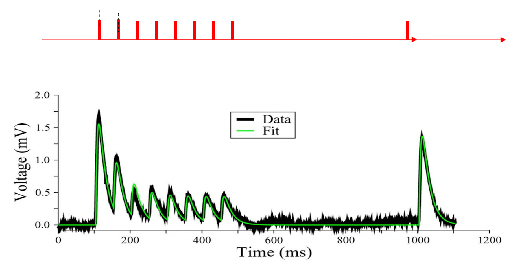
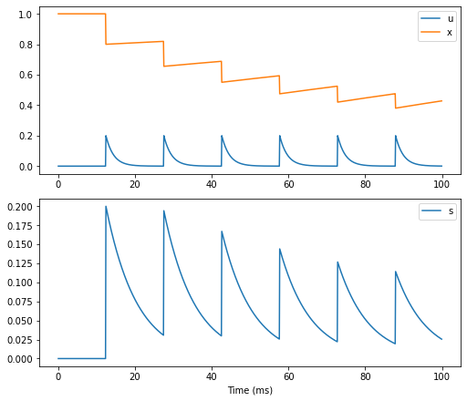
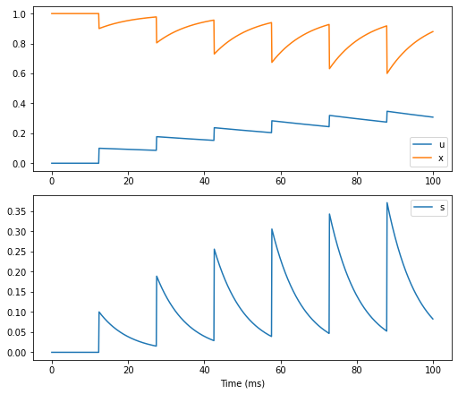
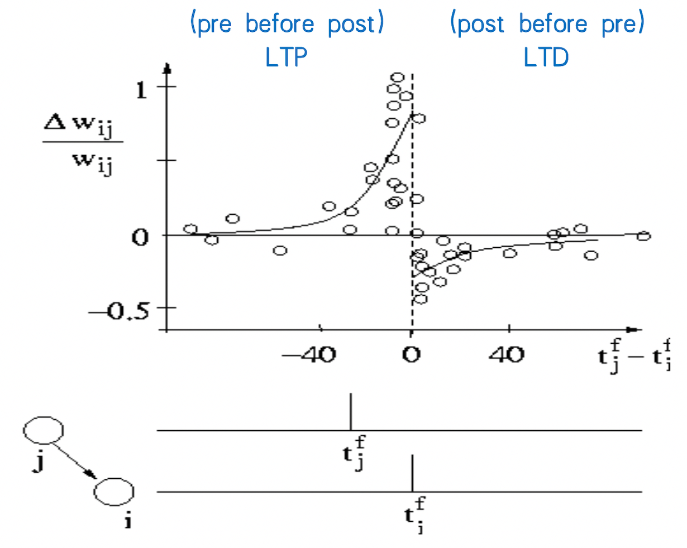
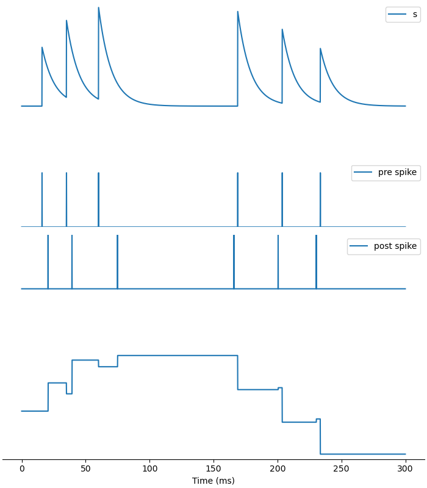
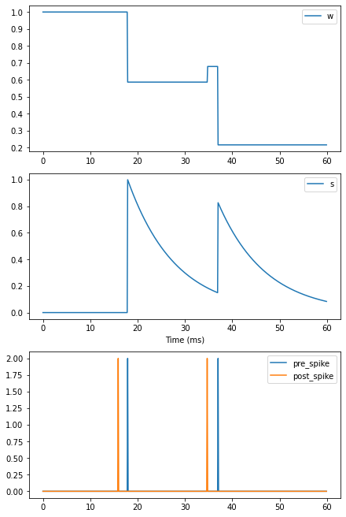
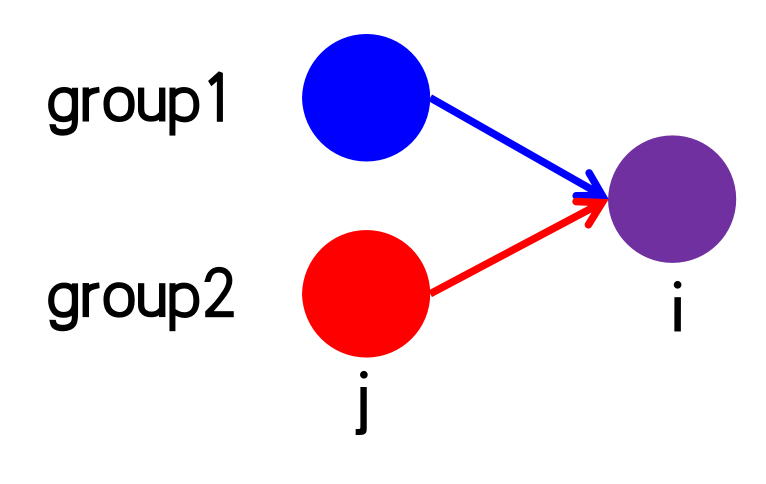
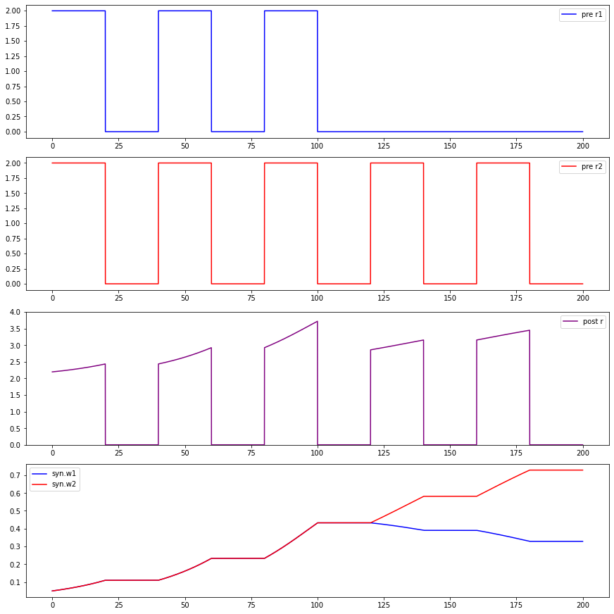
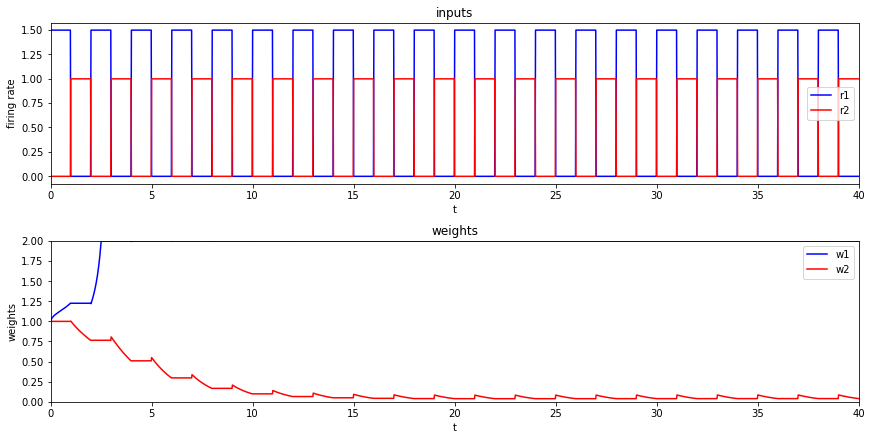

## 突触可塑性

我们刚刚讨论了突触动力学，但还没有涉及到突触可塑性。接下来就来看看如何使用BrainPy实现突触可塑性。

可塑性主要区分短时程可塑性与长时程可塑性。我们将首先介绍突触短时程可塑性（STP），然后介绍几种不同的突触长时程可塑性模型。

### 突触短时程可塑性（STP）

我们首先看实验的结果，图为突触前神经元发放时突触后神经元膜电位的变化。我们可以看到，当突触前神经元以短时间间隔持续发放的时候，突触后神经元的反应会越来越弱，呈现出短时程抑制 (short term depression)。但是很快就恢复了，所以这个可塑性是短期的。




模型的公式如下。在这里，短时程可塑性主要由$$u$$和$$x$$两个变量来描述。其中，$$u$$表示神经递质释放的概率，初始值为0，并随着突触前神经元的每次发放而增加，贡献短时程易化（STF）；而$$x$$代表神经递质的剩余量，初始值为1，每次突触前神经元发放都会用掉一些，这意味着它会减少，从而贡献短时程抑制（STD）。因此易化和抑制两个方向是同时发生的。$$\tau_f$$和$$\tau_d$$分别控制$$u$$和$$x$$的恢复速度，两者关系决定了可塑性的哪个方向起主导作用。

$$
\frac {dI} {dt} = - \frac I {\tau}
$$

$$
\frac {du} {dt} = - \frac u {\tau_f} 
$$

$$
\frac {dx} {dt} =  \frac {1-x} {\tau_d} 
$$

$$
\text{if (pre \ fire), then}
\begin{cases} 
u^+ = u^- + U(1-u^-) \\ 
I^+ = I^- + Au^+x^- \\
x^+ = x^- - u^+x^- 
\end{cases}
$$

用BrainPy实现的代码如下：


```python
class STP(bp.TwoEndConn):
    target_backend = 'general'

    @staticmethod
    def derivative(s, u, x, t, tau, tau_d, tau_f):
        dsdt = -s / tau
        dudt = - u / tau_f
        dxdt = (1 - x) / tau_d
        return dsdt, dudt, dxdt
    
    def __init__(self, pre, post, conn, delay=0., U=0.15, tau_f=1500., tau_d=200., tau=8.,  **kwargs):
        # parameters
        self.tau_d = tau_d
        self.tau_f = tau_f
        self.tau = tau
        self.U = U
        self.delay = delay

        # connections
        self.conn = conn(pre.size, post.size)
        self.conn_mat = conn.requires('conn_mat')
        self.size = bp.ops.shape(self.conn_mat)

        # variables
        self.s = bp.ops.zeros(self.size)
        self.x = bp.ops.ones(self.size)
        self.u = bp.ops.zeros(self.size)
        self.w = bp.ops.ones(self.size)
        self.I_syn = self.register_constant_delay('I_syn', size=self.size, delay_time=delay)

        self.integral = bp.odeint(f=self.derivative, method='exponential_euler')
        
        super(STP, self).__init__(pre=pre, post=post, **kwargs)


    def update(self, _t):
        self.s, u, x = self.integral(self.s, self.u, self.x, _t, self.tau, self.tau_d, self.tau_f)
        
        pre_spike_map = bp.ops.unsqueeze(self.pre.spike, 1) * self.conn_mat
        u += self.U * (1-self.u) * pre_spike_map
        self.s += self.w * u * self.x * pre_spike_map
        x -= u * self.x * pre_spike_map
        
        self.u = u
        self.x = x

        self.I_syn.push(self.s)
        self.post.input += bp.ops.sum(self.I_syn.pull(), axis=0)
```


```python
neu1 = bm.neurons.LIF(1, monitors=['V'])
neu2 = bm.neurons.LIF(1, monitors=['V'])

# STD
syn = STP(U=0.2, tau_d=150., tau_f=2., pre=neu1, post=neu2, 
          conn=bp.connect.All2All(), monitors=['s', 'u', 'x'])
net = bp.Network(neu1, syn, neu2)
net.run(100., inputs=(neu1, 'input', 28.))

# plot
fig, gs = bp.visualize.get_figure(2, 1, 3, 7)

fig.add_subplot(gs[0, 0])
plt.plot(net.ts, syn.mon.u[:, 0], label='u')
plt.plot(net.ts, syn.mon.x[:, 0], label='x')
plt.legend()

fig.add_subplot(gs[1, 0])
plt.plot(net.ts, syn.mon.s[:, 0], label='s')
plt.legend()

plt.xlabel('Time (ms)')
plt.show()
```





```python
neu1 = bm.neurons.LIF(1, monitors=['V'])
neu2 = bm.neurons.LIF(1, monitors=['V'])

# STF
syn = STP(U=0.1, tau_d=10, tau_f=100., pre=neu1, post=neu2, 
          conn=bp.connect.All2All(), monitors=['s', 'u', 'x'])
net = bp.Network(neu1, syn, neu2)
net.run(100., inputs=(neu1, 'input', 28.))

# plot
fig, gs = bp.visualize.get_figure(2, 1, 3, 7)

fig.add_subplot(gs[0, 0])
plt.plot(net.ts, syn.mon.u[:, 0], label='u')
plt.plot(net.ts, syn.mon.x[:, 0], label='x')
plt.legend()

fig.add_subplot(gs[1, 0])
plt.plot(net.ts, syn.mon.s[:, 0], label='s')
plt.legend()

plt.xlabel('Time (ms)')
plt.show()
```





这些图显示，当我们设置参数$$\tau_d>\tau_f$$、$$x$$每用掉一些后恢复非常缓慢，$$u$$每次上升后非常快衰减，因此，transmitter不够用了，不足以打开受体，表现出STD为主；
相反，当$$\tau_f > \tau_d$$，$$x$$每次用到后很快又补充回去了，总是有足够的transmitter可用。同时，$$u$$的衰减非常缓慢，因此释放transmitter的概率越来越高，表现出STF为主。

### 突触长时程可塑性

#### 脉冲时间依赖可塑性（STDP）

首先我们看实验上画的图，x轴是突触前神经元和突触后神经元发放的时间差，零的左侧代表突触前神经元的发放比突触后神经元的更早，由图片可以看出表现为长时程增强 (long term potentiation; LTP）；而零的右侧代表突触后神经元比突触前神经元更先发放，呈现表现为长时程抑制 (long term depression; LTD）。




模型公式如下，其中$$A_{source}$$和$$A_{target}$$两个变量分别控制LTD和LTP。当突触前神经元先于突触后神经元发放时，在突触后神经元发放之前，$$A_t$$一直为0，所以$$w$$暂时不会有变化，只是$$A_s$$持续增加；直到突触后神经元发放时，$$w$$增加$$A_s - A_t$$，所以表现为长时程增强（LTP）。反之亦然。

$$
\frac {dA_s} {dt} = - \frac {A_s} {\tau_s} 
$$

$$
\frac {dA_t} {dt} = - \frac {A_t} {\tau_t} 
$$

$$
\text{if (pre \ fire), then}
\begin{cases} 
s \leftarrow s + w \\
A_s \leftarrow A_s + \Delta A_s \\ 
w \leftarrow w - A_t 
\end{cases}
$$

$$
\text{if (post \ fire), then}
\begin{cases} 
A_t \leftarrow A_t + \Delta A_t \\ 
w \leftarrow w + A_s 
\end{cases}
$$

现在让我们看看如何使用BrainPy来实现这个模型。$$s$$会在突触前神经元出现脉冲时增加，这与前面介绍的突触模型的动力学一致，这里我们通常使用单指数衰减 (single exponential decay)模型来实现$$s$$的动力学。


```python
class STDP(bp.TwoEndConn):
    target_backend = 'general'
    
    @staticmethod
    def derivative(s, A_s, A_t, t, tau, tau_s, tau_t):
        dsdt = -s / tau
        dAsdt = - A_s / tau_s
        dAtdt = - A_t / tau_t
        return dsdt, dAsdt, dAtdt
    
    def __init__(self, pre, post, conn, delay=0., 
                delta_A_s=0.5, delta_A_t=0.5, w_min=0., w_max=20., 
                tau_s=10., tau_t=10., tau=10., **kwargs):
        # parameters
        self.tau_s = tau_s
        self.tau_t = tau_t
        self.tau = tau
        self.delta_A_s = delta_A_s
        self.delta_A_t = delta_A_t
        self.w_min = w_min
        self.w_max = w_max
        self.delay = delay

        # connections
        self.conn = conn(pre.size, post.size)
        self.conn_mat = conn.requires('conn_mat')
        self.size = bp.ops.shape(self.conn_mat)

        # variables
        self.s = bp.ops.zeros(self.size)
        self.A_s = bp.ops.zeros(self.size)
        self.A_t = bp.ops.zeros(self.size)
        self.w = bp.ops.ones(self.size) * 1.
        self.I_syn = self.register_constant_delay('I_syn', size=self.size, delay_time=delay)

        self.integral = bp.odeint(f=self.derivative, method='exponential_euler')
        
        super(STDP, self).__init__(pre=pre, post=post, **kwargs)


    def update(self, _t):
        s, A_s, A_t = self.integral(self.s, self.A_s, self.A_t, 
                                    _t, self.tau, self.tau_s, self.tau_t)
        w = self.w

        pre_spike_map = bp.ops.unsqueeze(self.pre.spike, 1) * self.conn_mat
        s += w * pre_spike_map
        A_s += self.delta_A_s * pre_spike_map
        w -= A_t * pre_spike_map
        
        post_spike_map = bp.ops.unsqueeze(self.post.spike, 0) * self.conn_mat
        A_t += self.delta_A_t * post_spike_map
        w += A_s * post_spike_map
        
        self.A_s = A_s
        self.A_t = A_t
        self.w = bp.ops.clip(w, self.w_min, self.w_max)
        self.s = s

        self.I_syn.push(self.s)
        self.post.input += bp.ops.sum(self.I_syn.pull(), axis=0)
```


```python
pre = bm.neurons.LIF(1, monitors=['spike'])
post = bm.neurons.LIF(1, monitors=['spike'])

# pre before post
duration = 60.
(I_pre, _) = bp.inputs.constant_current([(0, 5), (30, 15), 
                                         (0, 5), (30, 15), 
                                         (0, duration-40)])
(I_post, _) = bp.inputs.constant_current([(0, 7), (30, 15), 
                                          (0, 5), (30, 15), 
                                          (0, duration-7-35)])

syn = STDP(pre=pre, post=post, conn=bp.connect.All2All(), monitors=['s', 'A_s', 'A_t', 'w'])
net = bp.Network(pre, syn, post)
net.run(duration, inputs=[(pre, 'input', I_pre), (post, 'input', I_post)])

# plot
fig, gs = bp.visualize.get_figure(3, 1)

fig.add_subplot(gs[0, 0])
plt.plot(net.ts, syn.mon.w[:, 0], label='w')
plt.legend()

fig.add_subplot(gs[2, 0])
plt.plot(net.ts, 2*pre.mon.spike[:, 0], label='pre_spike')
plt.plot(net.ts, 2*post.mon.spike[:, 0], label='post_spike')
plt.legend()

fig.add_subplot(gs[1, 0])
plt.plot(net.ts, syn.mon.s[:, 0], label='s')
plt.legend()

plt.xlabel('Time (ms)')
plt.show()
```





结果正如我们所预期的，当突触前神经元在突触后神经元之前发放时，$$w$$增加，呈现LTP。

```python
pre = bm.neurons.LIF(1, monitors=['spike'])
post = bm.neurons.LIF(1, monitors=['spike'])

# post before pre
duration = 60.
(I_post, _) = bp.inputs.constant_current([(0, 5), (30, 15), 
                                         (0, 5), (30, 15), 
                                         (0, duration-40)])
(I_pre, _) = bp.inputs.constant_current([(0, 7), (30, 15), 
                                          (0, 5), (30, 15), 
                                          (0, duration-7-35)])

syn = STDP(pre=pre, post=post, conn=bp.connect.All2All(), monitors=['s', 'A_s', 'A_t', 'w'])
net = bp.Network(pre, syn, post)
net.run(duration, inputs=[(pre, 'input', I_pre), (post, 'input', I_post)])

# plot
fig, gs = bp.visualize.get_figure(3, 1)

fig.add_subplot(gs[0, 0])
plt.plot(net.ts, syn.mon.w[:, 0], label='w')
plt.legend()

fig.add_subplot(gs[2, 0])
plt.plot(net.ts, 2*pre.mon.spike[:, 0], label='pre_spike')
plt.plot(net.ts, 2*post.mon.spike[:, 0], label='post_spike')
plt.legend()

fig.add_subplot(gs[1, 0])
plt.plot(net.ts, syn.mon.s[:, 0], label='s')
plt.legend()

plt.xlabel('Time (ms)')
plt.show()
```





如我们所料，当突触后神经元先于突触前神经元发放时，$$w$$减少，呈现LTD。

#### Oja法则

接下来我们看基于赫布学习律（Hebbian learning）的发放率模型 (rate model)。

赫布学习律认为相互连接的两个神经元在经历同步的放电活动后，它们之间的突触连接就会得到增强。而这个同步不需要在意两个神经元前后发放的次序，因此可以忽略具体的发放时间，简化为发放率模型。我们首先看赫布学习律的一般形式，对于如图所示的$$j$$到$$i$$的连接，用$$v_j$$和$$v_i$$分别表示前神经元组和后神经元组的发放率 (firing rate)，根据赫布学习律的局部性(locality)特性，$$w_{ij}$$的变化受$$w$$本身、以及$$v_j, v_i$$的影响，可得以下微分方程。

$$
\frac d {dt} w_{ij} = F(w_{ij}; v_{i},v_j)
$$

把上式右边经过泰勒展开得到以下式子。

$$
\frac d {dt} w_{ij} = c_{00} w_{ij} + c_{10} w_{ij} v_j + c_{01} w_{ij} v_i + c_{20} w_{ij} v_j ^2 + c_{02} w_{ij} v_i ^2 + c_{11} w_{ij} v_i v_j + O(v^3)
$$

第6项包含$$v_i v_j$$，$$c_{11}$$非0才满足赫布学习律的同步发放。例如**Oja法则**的公式如下，可以看出对应于上式第5、6项。

$$
\frac d {dt} w_{ij} = \gamma [v_i v_j - w_{ij} v_i ^2 ]
$$


下面我们用BrainPy来实现Oja法则。


```python
class Oja(bp.TwoEndConn):
    target_backend = 'general'

    @staticmethod
    def derivative(w, t, gamma, r_pre, r_post):
        dwdt = gamma * (r_post * r_pre - r_post * r_post * w)
        return dwdt

    def __init__(self, pre, post, conn, delay=0.,
                 gamma=0.005, w_max=1., w_min=0.,
                 **kwargs):
        # params
        self.gamma = gamma
        self.w_max = w_max
        self.w_min = w_min
        # no delay in firing rate models

        # conns
        self.conn = conn(pre.size, post.size)
        self.conn_mat = conn.requires('conn_mat')
        self.size = bp.ops.shape(self.conn_mat)

        # data
        self.w = bp.ops.ones(self.size) * 0.05

        self.integral = bp.odeint(f=self.derivative)
        super(Oja, self).__init__(pre=pre, post=post, **kwargs)

    def update(self, _t):
        w = self.conn_mat * self.w
        self.post.r = bp.ops.sum(w.T * self.pre.r, axis=1)
        
        # resize to matrix
        dim = self.size
        r_post = bp.ops.vstack((self.post.r,) * dim[0])
        r_pre = bp.ops.vstack((self.pre.r,) * dim[1]).T
        
        self.w = self.integral(w, _t, self.gamma, r_pre, r_post)
```

我们打算实现如图所示的连接，紫色同时接受蓝色和红色两群神经元的输入。给后神经元的input和红色是完全一致的，而蓝色一开始一致，后来不一致了。



由于Oja是一个发放率模型，我们需要一个基于发放率的神经元模型来观察两组神经元的学习规则。


```python
class neu(bp.NeuGroup):
    target_backend = 'general'

    @staticmethod
    def integral(r, t, I, tau):
        dr = -r / tau + I
        return dr

    def __init__(self, size, tau=10., **kwargs):
        self.tau = tau

        self.r = bp.ops.zeros(size)
        self.input = bp.ops.zeros(size)

        self.g = bp.odeint(self.integral)

        super(neu, self).__init__(size=size, **kwargs)

    def update(self, _t):
        self.r = self.g(self.r, _t, self.input, self.tau)
        self.input[:] = 0
```


```python
# set params
neu_pre_num = 2
neu_post_num = 2
dt = 0.02
bp.backend.set('numpy', dt=dt)

# build network
neu_pre = neu(neu_pre_num, monitors=['r'])
neu_post = neu(neu_post_num, monitors=['r'])

syn = Oja(pre=neu_pre, post=neu_post,
          conn=bp.connect.All2All(), monitors=['w'])

net = bp.Network(neu_pre, syn, neu_post)

# create input
current_mat_in = []
current_mat_out = []
current1, _ = bp.inputs.constant_current(
    [(2., 20.), (0., 20.)] * 3 + [(0., 20.), (0., 20.)] * 2)
current2, _ = bp.inputs.constant_current([(2., 20.), (0., 20.)] * 5)
current3, _ = bp.inputs.constant_current([(2., 20.), (0., 20.)] * 5)
current_mat_in = np.vstack((current1, current2))
current_mat_out = current3
current_mat_out = np.vstack((current_mat_out, current3))

# simulate network
net.run(duration=200.,
        inputs=[(neu_pre, 'r', current_mat_in.T, '='),
                (neu_post, 'r', current_mat_out.T)])

# paint
fig, gs = bp.visualize.get_figure(4, 1, 3, 12)

fig.add_subplot(gs[0, 0])
plt.plot(net.ts, neu_pre.mon.r[:, 0], 'b', label='pre r1')
plt.legend()

fig.add_subplot(gs[1, 0])
plt.plot(net.ts, neu_pre.mon.r[:, 1], 'r', label='pre r2')
plt.legend()

fig.add_subplot(gs[2, 0])
plt.plot(net.ts, neu_post.mon.r[:, 0], color='purple', label='post r')
plt.ylim([0, 4])
plt.legend()

fig.add_subplot(gs[3, 0])
plt.plot(net.ts, syn.mon.w[:, 0, 0], 'b', label='syn.w1')
plt.plot(net.ts, syn.mon.w[:, 1, 0], 'r', label='syn.w2')
plt.legend()
plt.show()
```





从结果可以看到，一开始两群神经元同时给input时，他们的weights都上升，post的反应越来越强，显示出LTP。100ms后，group1不再一起发放，只有group2给input，就只有group2的weights增加。结果符合Hebbian learning的fire together，wire together。

#### BCM法则

BCM法则的公式如下：

$$
\frac d{dt} w_{ij} =  \eta v_i(v_i - v_\theta) v_j
$$

公式右边画出来如下图所示，当发放频率高于阈值时呈现LTP，低于阈值时则为LTD。因此，通过调整阈值可以实现选择性。


这里我们使用和Oja法则相同的连接方式，只是两群神经元为交替发放。其中，蓝色总比红色发放更强一些。动态调整阈值为$$v_i$$的时间平均，即 $$v_\theta = f(v_i)$$。BrainPy实现的代码如下，在``update``函数中更新阈值。


```python
class BCM(bp.TwoEndConn):
    target_backend = 'general'

    @staticmethod
    def derivative(w, t, lr, r_pre, r_post, r_th):
        dwdt = lr * r_post * (r_post - r_th) * r_pre
        return dwdt

    def __init__(self, pre, post, conn, lr=0.005, w_max=2., w_min=0., **kwargs):
        # parameters
        self.lr = lr
        self.w_max = w_max
        self.w_min = w_min
        self.dt = bp.backend._dt

        # connections
        self.conn = conn(pre.size, post.size)
        self.conn_mat = conn.requires('conn_mat')
        self.size = bp.ops.shape(self.conn_mat)

        # variables
        self.w = bp.ops.ones(self.size)
        self.sum_post_r = bp.ops.zeros(post.size[0])

        self.int_w = bp.odeint(f=self.derivative, method='rk4')

        super(BCM, self).__init__(pre=pre, post=post, **kwargs)

    def update(self, _t):
        # update threshold
        self.sum_post_r += self.post.r
        r_th = self.sum_post_r / (_t / self.dt + 1)

        # resize to matrix
        w = self.w * self.conn_mat
        dim = self.size
        r_th = bp.ops.vstack((r_th,) * dim[0])
        r_post = bp.ops.vstack((self.post.r,) * dim[0])
        r_pre = bp.ops.vstack((self.pre.r,) * dim[1]).T

        # update w
        w = self.int_w(w, _t, self.lr, r_pre, r_post, r_th)
        self.w = bp.ops.clip(w, self.w_min, self.w_max)

        # output
        self.post.r = bp.ops.sum(w.T * self.pre.r, axis=1)
```


```python
w_max = 2.
n_post = 1
n_pre = 20

# group selection
group1, duration = bp.inputs.constant_current(([1.5, 1], [0, 1]) * 20)
group2, duration = bp.inputs.constant_current(([0, 1], [1., 1]) * 20)

group1 = bp.ops.vstack((
                    (group1,)*10))

group2 = bp.ops.vstack((
                    (group2,)*10
                    ))
input_r = bp.ops.vstack((group1, group2))

pre = neu(n_pre, monitors=['r'])
post = neu(n_post, monitors=['r'])
bcm = BCM(pre=pre, post=post,conn=bp.connect.All2All(),
          monitors=['w'])

net = bp.Network(pre, bcm, post)
net.run(duration, inputs=(pre, 'r', input_r.T, "="))

w1 = bp.ops.mean(bcm.mon.w[:, :10, 0], 1)
w2 = bp.ops.mean(bcm.mon.w[:, 10:, 0], 1)

r1 = bp.ops.mean(pre.mon.r[:, :10], 1)
r2 = bp.ops.mean(pre.mon.r[:, 10:], 1)
post_r = bp.ops.mean(post.mon.r[:, :], 1)

fig, gs = bp.visualize.get_figure(2, 1, 3, 12)
fig.add_subplot(gs[1, 0], xlim=(0, duration), ylim=(0, w_max))
plt.plot(net.ts, w1, 'b', label='w1')
plt.plot(net.ts, w2, 'r', label='w2')
plt.title("weights")
plt.ylabel("weights")
plt.xlabel("t")
plt.legend()

fig.add_subplot(gs[0, 0], xlim=(0, duration))
plt.plot(net.ts, r1, 'b', label='r1')
plt.plot(net.ts, r2, 'r', label='r2')
plt.title("inputs")
plt.ylabel("firing rate")
plt.xlabel("t")
plt.legend()

plt.show()
```





结果发现，对input较强的group 1是LTP，而对input较弱的group 2是LTD，最终选择了group 1。