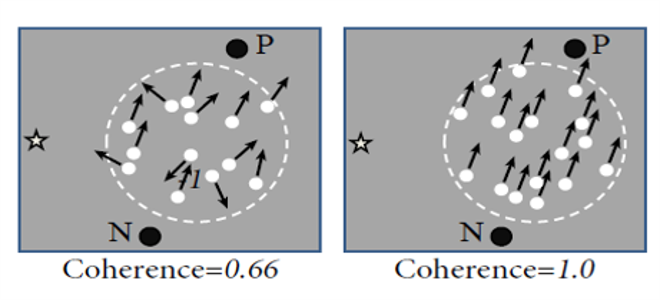
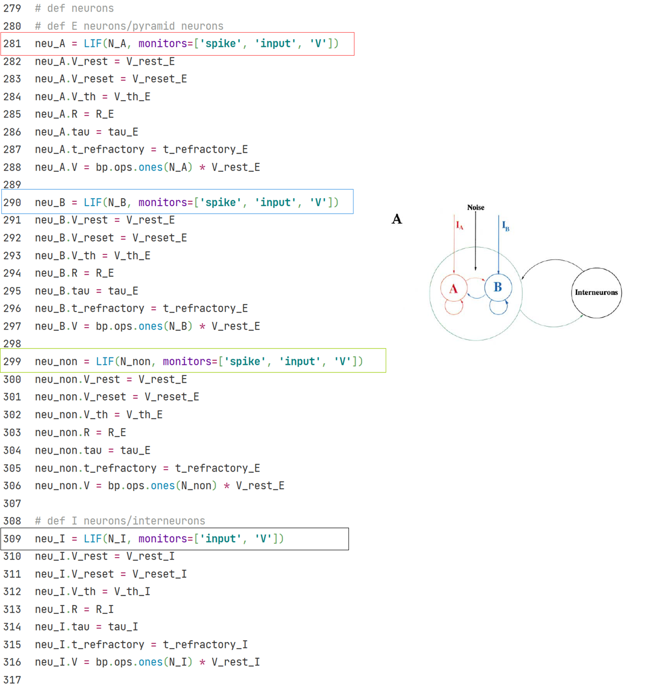
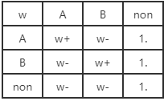

## 3.1 Spiking Neural Network

### 3.1.1 E/I balanced network

In 1990s, biologists found in experiments that neuron activities in brain cortex show a temporal irregular spiking pattern. This pattern exists widely in brain areas, but researchers knew few about its mechanism or function.

Vreeswijk and Sompolinsky (1996) proposed E/I balanced network to explain this irregular spiking pattern. The feature of this network is the strong, random and sparse synapse connections between neurons. Because of this feature and corresponding parameter settings, each neuron in the network will receive great excitatory and inhibitory input from within the network. However, these two types of inputs will cancel each other, and maintain the total internal input at a relatively small order of magnitude, which is only enough to generate action potentials.

The randomness and noise in E/I balanced network give  each neuron in the network an internal input which varies with time and space at the order of threshold potential. Therefore, the firing of neurons also has randomness, ensures that E/I balanced network can generate temporal irregular firing pattern spontaneously.

<b>Fig.3-2 Structure of E/I balanced network | Vreeswijk and Sompolinsky, 1996</b>

Vreeswijk and Sompolinsky also suggested a possible function of this irregular firing pattern: E/I balanced network can respond to the changes of external stimulus quickly.

As shown in Fig. 3-3, when there is no external input, the distribution of neurons’ membrane potentials in E/I balanced network follows a relatively uniform random distribution between resting potential $$V_0$$and threshold potential $$\theta$$.

<b>Fig.3-3 Distribution of neuorn membrane potentials in E/I balanced network 
    | Tian et al., 2020</b>

When we give the network a small constant external stimulus, those neurons whose membrane potentials fall near the threshold potential will soon meet the threshold, therefore spike rapidly. On the network scale, the firing rate of the network can adjust rapidly once the input changes.

Simulation suggests that the delay of network response to input and the delay of synapses have the same time scale, and both are significantly smaller than the delay of a single neuron from resting potential to generating a spike. So E/I balanced network may provide a fast response mechanism for neural networks. 

Fig. 3-2 shows the structure of E/I balanced network:

1)	Neurons: Neurons are realized with LIF neuron model. The neurons can be divided into excitatory neurons and inhibitory neurons, the ratio of the two types of neurons is $$N_E$$: $$N_I$$ = 4:1.

2)	Synapses: Synapses are realized with exponential synapse model. 4 groups of synapse connections are generated between the two groups of neurons, that is, excitatory-excitatory connection (E2E conn), excitatory-inhibitory connection (E2I conn), inhibitory-excitatory connection (I2E conn) and inhibitory-inhibitory connection (I2I conn). For excitatory or inhibitory synapse connections, we define synapse weights with different signal.

	

3)	Inputs: All neurons in the network receive a constant external input current.

	

See above section 1 and 2 for definition of LIF neuron and exponential synapse. After simulation, we visualize the raster plot and firing rate-t plot of E/I balanced network. the network firing rate changes from strong synchronization to irregular fluctuation.

	

<b>Fig.3-3 E/I balanced net raster plot</b>

### 3.1.2 Decision Making Network

The modeling of computational neuroscience networks can correspond to specific physiological tasks. 

For example, in the visual motion discrimination task (Roitman and Shadlen, 2002), rhesus watch a video in which random dots move towards left or right with definite coherence. Rhesus are required to choose the direction that most dots move to and give their answer by saccade. At the meantime, researchers record the activity of their LIP neurons by implanted electrode.

 

<b>Fig.3-4 Experimental Diagram</b>

Wang (2002) proposed a decision making network to model the activity of rhesus LIP neurons during decision making period in the visual motion discrimination task. 

As shown in Fig. 3-5, this network is based on E/I balanced network. The ratio of excitatory neurons and inhibitory neurons is $$N_E:N_I = 4:1$$, and parmeters are adjusted to maintain the balanced state.

To accomplish the decision making task, among the excitatory neuron group, two selective subgroup A and B are chosen, both with a size of $$N_A = N_B = 0.15N_E$$. These two subgroups are marked as A and B in Fig. 3-5, and we call other excitatory neurons as non-selective neurons, $$N_{non} = (1-2*0.15)N_E$$.

<b>Fig.3-5 structure of decision makingnetwork</b>

	

As it is in E/I balanced network, 4 groups of synapses ---- E2E connection, E2I connection, I2E connection and I2I connection ---- are build in decision making network. Excitatory connections are realized with AMPA synapse, inhibitory connections are realized with GABAa synapse.

Decision making network needs to make a decision among the two choice, i.e. among the two subgroups A and B in this task. To achieve this, network must discriminate between this two groups. Excitatory neurons in the same subgroup should self-activate, and inhibit neurons in another selective subgroup. 

Therefore, E2E connections are structured in the network. As shown in Sheet 3-1, $$w+ > 1 > w-$$. In this way, a relative activation is established within the subgroups by stronger excitatory synapse connections, and relative inhibition is established between two subgroups or between selective and non-selective subgroups by weaker excitatory synapse connections.

<b>Sheet 3-1 Weight of synapse connections between E-neurons</b>

	

We give two types of external inputs to the decision making network:

1) Background inputs from other brain areas without specific meaning. Represented as high frequency Poisson input mediated by AMPA synapse.

	

2) Stimulus inputs from outside the brain, which are given only to the two selective subgroup A and B. Represented as lower frequency Poisson input mediated by AMPA synapse. 

The frequency of Poisson input given to A and B subgroup have a certain difference, simulate the difference in the number of dots moving to left and right in physiological experiments, induce the network to make a decision among these two subgroups.
$$
\rho_A = \rho_B = \mu_0/100
$$

$$
\mu_A = \mu_0 + \rho_A * c
$$

$$
\mu_B = \mu_0 + \rho_B * c
$$

Every 50ms, the Poisson frequencies $$f_x$$ change once, follows a Gaussian distribution defined by mean $$\mu_x$$ and variance $$\delta^2$$.
$$
f_A \sim N(\mu_A, \delta^2)
$$

$$
f_B \sim N(\mu_B, \delta^2)
$$

	

	

During the simulation, subgroup A receives a larger stimulus input than B, after a definite delay period, the activity of group A is significantly higher than group B, which means, the network choose the right direction.

<b>Fig.3-6 decision making network</b>

