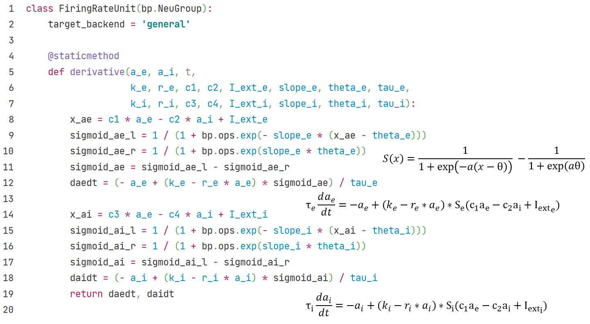
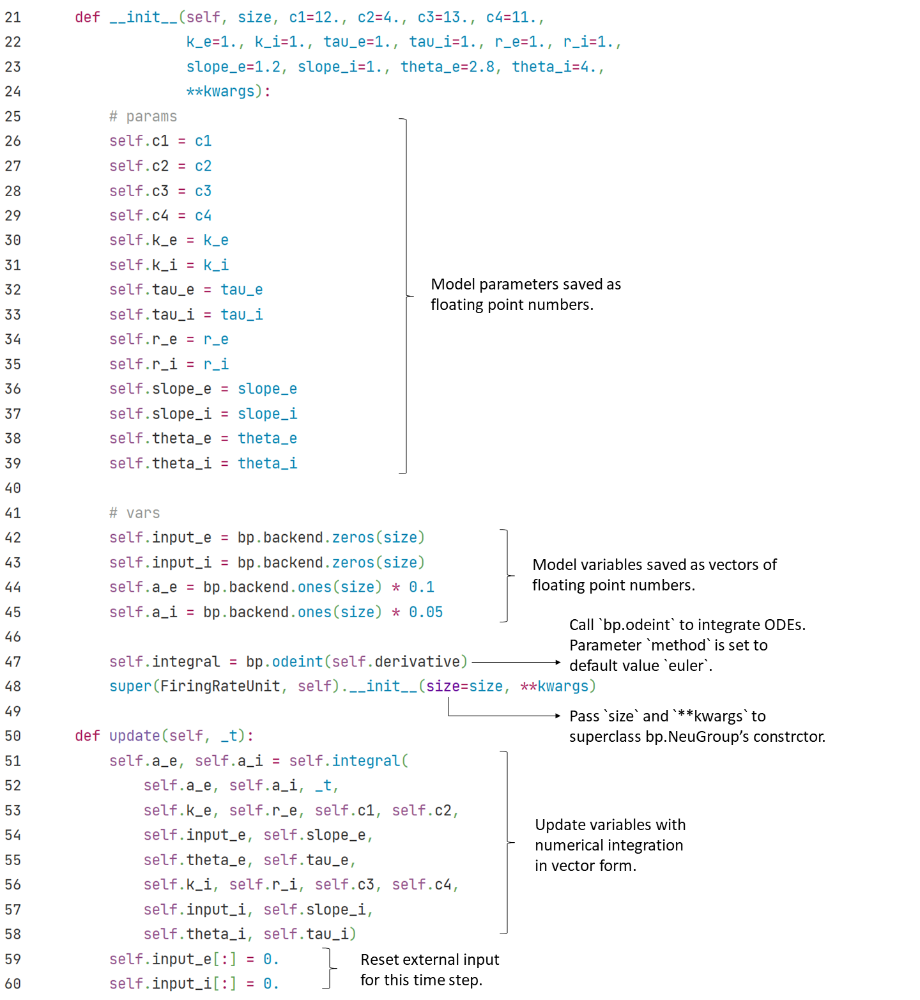

## 1.4 Firing Rate models

Firing Rate models are simpler than reduced models. In these models, each compute unit represents a neuron group, the membrane potential variable $$V$$ in single neuron models is replaced by firing rate variable $$a$$ (or $$r$$ or $$\nu$$). Here we introduce a canonical firing rate unit.

### 1.4.1 Firing Rate Units

Wilson and Cowan (1972) proposed this unit to represent the activities in excitatory and inhibitory cortical neuron columns. Each element of variables $$a_e$$ and $$a_i$$ refers to the average activity of a neuron column group contains multiple neurons.

$$
\tau_e \frac{d a_e(t)}{d t} = - a_e(t) + (k_e - r_e * a_e(t)) * \mathcal{S}(c_1 a_e(t) - c_2 a_i(t) + I_{ext_e}(t))
$$

$$
\tau_i \frac{d a_i(t)}{d t} = - a_i(t) + (k_i - r_i * a_i(t)) * \mathcal{S}(c_3 a_e(t) - c_4 a_i(t) + I_{ext_i}(t))
$$

$$
\mathcal{S}(x) = \frac{1}{1 + exp(- a(x - \theta))} - \frac{1}{1 + exp(a\theta)}
$$

$$x\in\{E, I\}$$ represents the excitatory and inhibitory neuron columns. In the differential equations, $$\tau_x$$ refers to the time constant of neuron columns, parameters $$k_x$$ and $$r_x$$ control the refractory periods, $$a_x$$ and $$\theta_x$$ refer to the slope factors and phase parameters of sigmoid functions, and external inputs $$I_{ext_x}$$ are given separately to excitatory and inhibitory neuron groups.

	

	

