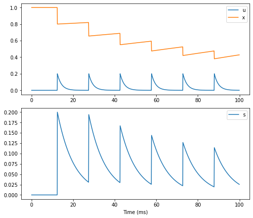
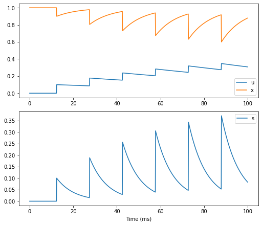
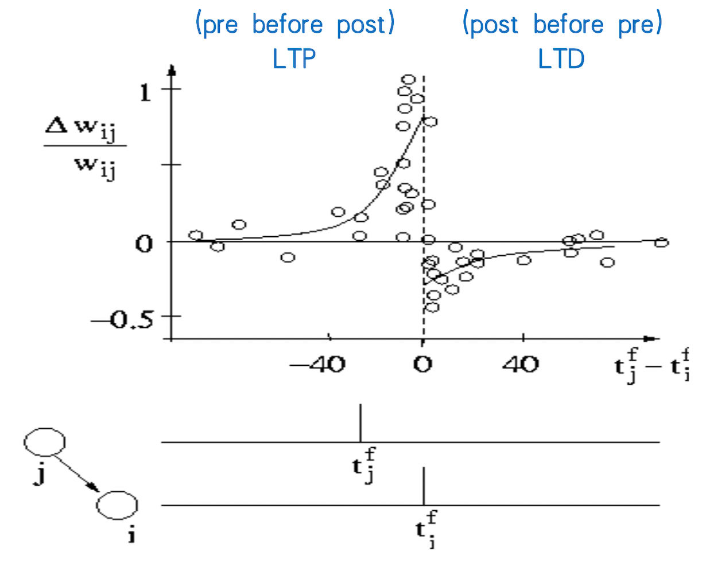
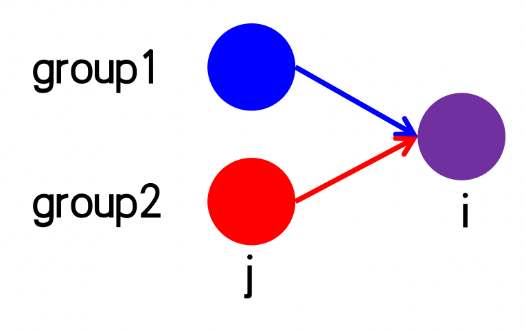
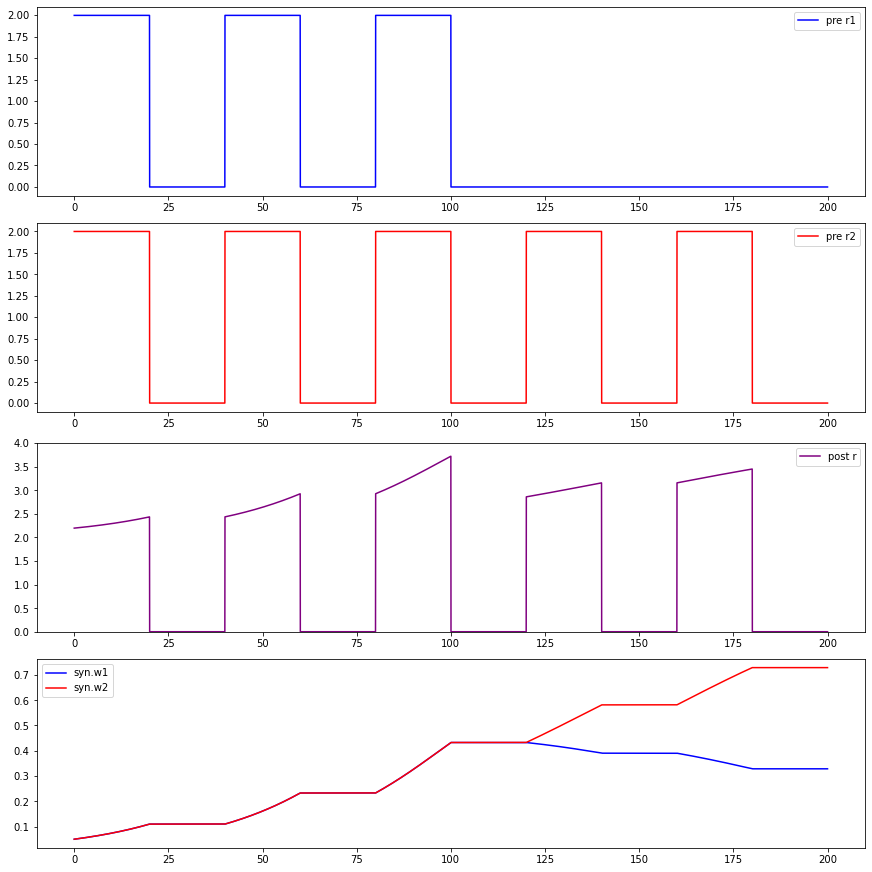

## 2.2 Plasticity Models

We just talked about synaptic dynamics, but we haven't talked about synaptic plasticity. Next, let's see how to use BrainPy to implement synaptic plasticity.

Plasticity mainly distinguishes short-term plasticity from long-term plasticity. We will first introduce short-term plasticity (STP), and then introduce several different models of long-term synaptic plasticity (also known as learning rules).

The introduction is as follows:

- short-term plasticity

- long-term plasticity
  - Spike-timing dependent plasticity

  - Rate based Hebb rule

    - Oja's rule
    - BCM rule

### 2.2.1 STP

Let's first look at short-term plasticity. We will start with the results of the experiment. Fig. 2-1 shows the changes of the membrane potential of postsynaptic neurons as the firing of presynaptic neurons. We can see that when the presynaptic neurons repeatedly firing with short intervals, the response of the postsynaptic neurons becomes weaker and weaker, showing a short term depression. But the response recovers after a short period of time, so this plasticity is short-term.

<div style="text-align:center">
  
  <br>
  <strong>Fig. 2-1 Short-term plasticity.</strong> (Aaptive from <cite>Gerstner et al., 2014 <sup><a href="#Gerstner2014">[1]</a></sup></cite>)
</div>
<div><br></div>

Now let's turn to the model. The short term plasticity can be described by two variables, $$u$$ and $$x$$. Where $$u$$ represents the probability of neurotransmitter release, and  $$x$$ represents the residual amount of neurotransmitters. The dynamic of a synapse with short term plasticity is given by,
$$
\frac {dI} {dt} = - \frac I {\tau}
$$

$$
\frac {du} {dt} = - \frac u {\tau_f} 
$$

$$
\frac {dx} {dt} =  \frac {1-x} {\tau_d} 
$$

$$
\text{if (pre fire), then}
\begin{cases} 
u^+ = u^- + U(1-u^-) \\ 
I^+ = I^- + Au^+x^- \\
x^+ = x^- - u^+x^- 
\end{cases}
$$

where the dynamics of the synaptic current $$I$$ can be one of the dynamics we introduced in the previous section (i.e., the dynamic of gating variable $$s$$ under current-based condition). $$U$$ and $$A$$ are two constants representing the increments of $$u$$ and $$I$$ after a presynaptic spike, respectively.  $$\tau_f$$ and $$\tau_d$$ are time constants of $$u$$ and $$x$$, respectively.

In this model, $$u$$ contributes the short-term facilitation (STF) by increasing from 0 whenever there is a spike on the presynaptic neuron; while $$x$$ contributes to the short-term depression (STD) by decreasing from 1 after presynaptic spike. The two directions of facilitation and depression occur simultaneously, and the value of $$\tau_f$$ and $$\tau_d$$ determines which direction of plasticity plays a dominant role.

The code implemented with BrainPy is as follows:


Then let's define a function to run the code. Like synapse models, we need two neuron groups to be connected. Besides the dynamic of $$s$$, we also want to see how $$u$$ and $$x$$ changes over time, so we monitor 's', 'u' and 'x' and plot them.

``` python
def run_stp(**kwargs):
    neu1 = bm.neurons.LIF(1, monitors=['V'])
    neu2 = bm.neurons.LIF(1, monitors=['V'])

    syn = STP(pre=neu1, post=neu2, conn=bp.connect.All2All(),
              monitors=['s', 'u', 'x'], **kwargs)
    net = bp.Network(neu1, syn, neu2)
    net.run(100., inputs=(neu1, 'input', 28.))

    # plot
    fig, gs = bp.visualize.get_figure(2, 1, 3, 7)

    fig.add_subplot(gs[0, 0])
    plt.plot(net.ts, syn.mon.u[:, 0], label='u')
    plt.plot(net.ts, syn.mon.x[:, 0], label='x')
    plt.legend()

    fig.add_subplot(gs[1, 0])
    plt.plot(net.ts, syn.mon.s[:, 0], label='s')
    plt.legend()

    plt.xlabel('Time (ms)')
    plt.show()
```

Let's first set ``tau_d`` > ``tau_f``.


```python
run_stp(U=0.2, tau_d=150., tau_f=2.)
```




The plot show that when we set the parameters $$\tau_d > \tau_f$$, $$x$$ recovers very slowly, and $$u$$ decays very quickly, so in the end, the transmitter is not enough to open the receptors, showing STD dominants.

Then let's set ``tau_f`` > ``tau_d``.

```python
run_stp(U=0.1, tau_d=10, tau_f=100.)
```




We can see from the figure that when we set $$\tau_f > \tau_d$$, on the contrary, every time $$x$$ is used, it will be added back quickly. There are always enough transmitters available. At the same time, the decay of $$u$$ is very slow, so the probability of releasing transmitters is getting higher and higher, showing STF dominants.


### 2.2.2 Long-term Plasticity

#### STDP

Fig. 2-2 shows the spiking timing dependent plasticity (STDP) of experimental results. The x-axis is the time difference between the spike of the presynaptic neuron and the postsynaptic neuron. The left part of the zero represents the spike timing of the presynaptic neuron earlier than that of the postsynaptic neuron, which shows long term potentiation (LTP); and the right side of the zero represents the postsynaptic neuron fires before the presynaptic neuron does, showing long term depression（LTD）。

<div style="text-align:center">
  
  <br>
  <strong>Fig. 2-2 Spike timing dependent plasticity.</strong> (Adative from <cite>Bi & Poo, 2001 <sup><a href="#Bi2001">[2]</a></sup></cite>)
</div>


<div><br></div>

The model formula is as follows, 

$$
\frac {dA_s} {dt} = - \frac {A_s} {\tau_s} 
$$

$$
\frac {dA_t} {dt} = - \frac {A_t} {\tau_t} 
$$

$$
\text{if (pre fire), then}
\begin{cases} 
s \leftarrow s + w \\
A_s \leftarrow A_s + \Delta A_s \\ 
w \leftarrow w - A_t 
\end{cases}
$$

$$
\text{if (post fire), then}
\begin{cases} 
A_t \leftarrow A_t + \Delta A_t \\ 
w \leftarrow w + A_s 
\end{cases}
$$


As STP model, $$w$$ is the synaptic weight, and $$s$$ is the gating variable. Variables $$A_{s}$$ and $$A_{t}$$ control the LTD and LTP respectively. $$\Delta A_s$$ and $$\Delta A_t$$ are the increments of $$A_{s}$$ and $$A_{t}$$, respectively. $$\tau_s$$ and $$\tau_t$$ are time constants.

When the presynaptic neuron fire before the postsynaptic neuron, $$A_t$$ is always 0 until the postsynaptic neuron fire, so $$w$$ will not change for the time being, but $$A_s$$ keep increases; when there is a spike in the postsynaptic neuron, $$w$$ increase with an amount of $$A_s - A_t$$, so it is LTP, and vice verse.

Now let's see how to use BrainPy to implement this model. Here $$s$$ is incremental when there is a spike of the presynaptic neuron, which is the same as the previous common synapse model. So this placement can be added to the previous synapse models. Here we usually use single exponential decay to implement the dynamics of $$s$$.


Here we stimulate the presynaptic group and postsynaptic group in different time by varying the input current of the two groups. We apply the first input to the presynaptic group starting at $$t=5ms$$, then stimulate the postsynaptic group starting at $$t=10ms$$, and keep the stimulating interval at $$15ms$$, so $$t_{post}=t_{pre}+5$$. Then we set a long interval after the 3rd spike pairs and change the stimulating order to be $$t_{post}=t_{pre}-3$$ at the 4th spike, so the interval of the postsynaptic group should be $$8ms$$ shorter than the presynaptic one.

``` python
duration = 300.
(I_pre, _) = bp.inputs.constant_current([(0, 5), (30, 15),   # pre at 5ms
                 (0, 15), (30, 15),  
                 (0, 15), (30, 15),
                 (0, 98), (30, 15),  # switch order: t_interval=98ms
                 (0, 15), (30, 15),
                 (0, 15), (30, 15),
                 (0, duration-155-98)])
(I_post, _) = bp.inputs.constant_current([(0, 10), (30, 15), # post at 10 
                  (0, 15), (30, 15),
                  (0, 15), (30, 15),
                  (0, 90), (30, 15), # switch order: t_interval=98-8=90(ms)
                  (0, 15), (30, 15),
                  (0, 15), (30, 15),
                  (0, duration-160-90)])
```

Then  run the simulation.


```python
pre = bm.neurons.LIF(1, monitors=['spike'])
post = bm.neurons.LIF(1, monitors=['spike'])

syn = STDP(pre=pre, post=post, conn=bp.connect.All2All(), monitors=['s', 'w'])
net = bp.Network(pre, syn, post)
net.run(duration, inputs=[(pre, 'input', I_pre), (post, 'input', I_post)])

# plot
fig, gs = bp.visualize.get_figure(4, 1, 2, 7)

def hide_spines(my_ax):
    plt.legend()
    plt.xticks([])
    plt.yticks([])
    my_ax.spines['left'].set_visible(False)
    my_ax.spines['right'].set_visible(False)
    my_ax.spines['bottom'].set_visible(False)
    my_ax.spines['top'].set_visible(False)

ax=fig.add_subplot(gs[0, 0])
plt.plot(net.ts, syn.mon.s[:, 0], label="s")
hide_spines(ax)

ax1=fig.add_subplot(gs[1, 0])
plt.plot(net.ts, pre.mon.spike[:, 0], label="pre spike")
plt.ylim(0, 2)
hide_spines(ax1)
plt.legend(loc = 'center right')

ax2=fig.add_subplot(gs[2, 0])
plt.plot(net.ts, post.mon.spike[:, 0], label="post spike")
plt.ylim(-1, 1)
hide_spines(ax2)

ax3=fig.add_subplot(gs[3, 0])
plt.plot(net.ts, syn.mon.w[:, 0], label="w")
plt.legend()
# hide spines
plt.yticks([])
ax3.spines['left'].set_visible(False)
ax3.spines['right'].set_visible(False)
ax3.spines['top'].set_visible(False)

plt.xlabel('Time (ms)')
plt.show()
```


The simulation result shows that weights $$w$$ increase when the presynaptic neuron fire before the postsynaptic neuron (before 150ms); and decrease when the order switched (after 150ms).


#### Oja's rule

Next, let's look at the rate model based on Hebbian learning. Because Hebbian learning is "fire together, wire together", regardless of the order before and after, spiking time can be ignored, so it can be simplified as a rate-based model. Let's first look at the general form of Hebbian learning. For the $$j$$ to $$i$$ connection as shown in the figure, $$r_j, r_i$$ denotes the firing rate of pre- and post-neuron groups, respectively. According to the locality characteristic of Hebbian learning, The change of $$w_{ij}$$ is affected by $$w$$ itself and $$r_j, r_i$$, we get the following differential equation.

$$
\frac d {dt} w_{ij} = F(w_{ij}; r_{i},r_j)
$$

The following formula is obtained by Taylor expansion on the right side of the above formula.

$$
\frac d {dt} w_{ij} = c_{00} w_{ij} + c_{10} w_{ij} r_j + c_{01} w_{ij} r_i + c_{20} w_{ij} r_j ^2 + c_{02} w_{ij} r_i ^2 + c_{11} w_{ij} r_i r_j + O(r^3)
$$

The 6th term contains $$r_i r_j$$，only if $$c_{11}$$ is not zero can the "fire together" of Hebbian learning be satisfied. For example, the formula of ``Oja's rule`` is as follows, which corresponds to 5th and 6th terms of the above formula.

$$
\frac d {dt} w_{ij} = \gamma [r_i r_j - w_{ij} r_i ^2 ]
$$

$$\gamma$$ represents the learning rate.

Now let's see how to use BrainPy to implement ``Oja's rule``.


Since Oja's rule is a rate-based model, we need a rate-based neuron model to see this learning rule of two groups of neurons.


<div style="text-align:center">
  
  <br>
  <strong>Fig. 2-3 Connection of neuron groups.</strong>
</div>
<div><br></div>

We aim to implement the connection as shown in Fig. 2-3. The purple neuron group receives inputs from the blue and red groups. The external input to the post group is exactly the same as the red one, while the blue one is the same at first, but not later.

The simulation code is as follows.




It can be seen from the results that at the beginning, when the two groups of neurons were given input at the same time, their weights increased simultaneously, and the response of post became stronger and stronger, showing LTP. After 100ms, the blue group is no longer fire together, only the red group still fire together, and only the weights of the red group are increased. The results accord with the "fire together, wire together" of Hebbian learning.


#### BCM rule

The BCM rule is given by,

$$
\frac d{dt} w_{ij} =  \eta r_i(r_i - r_\theta) r_j
$$

where $$\eta$$ represents the learning rate, and $$r_\theta$$ represents the threshold of learning (see Fig. 2-4). Fig. 2-4 shows the right side of the formula. When the firing rate is greater than the threshold, there is LTP, and when the firing rate is lower than the threshold, there is LTD. Therefore, the selectivity can be achieved by adjusting the threshold $$r_\theta$$.


<div style="text-align:center">
  
  <br>
    <strong> Fig. 2-4 BCM rule </strong> (Adaptive from <cite>Gerstner et al., 2014 <sup>[1]</sup></cite>)
</div>
<div><br></div>

Here we implement the same connections as the previous Oja's rule (Fig. 2-3), with different firing rates. Here the two groups of neurons are alternately firing. Among them, the blue group is always stronger than the red one. We adjust the threshold by setting it as the time average of $$r_i$$, that is $$r_\theta = f(r_i)$$. The code implemented by BrainPy is as follows.


Then we can run the simulation with the following code.


```python
n_post = 1
n_pre = 20

# group selection
group1, duration = bp.inputs.constant_current(([1.5, 1], [0, 1]) * 20)
group2, duration = bp.inputs.constant_current(([0, 1], [1., 1]) * 20)
group1 = bp.ops.vstack(((group1,)*10))
group2 = bp.ops.vstack(((group2,)*10))
input_r = bp.ops.vstack((group1, group2))

pre = neu(n_pre, monitors=['r'])
post = neu(n_post, monitors=['r'])
bcm = BCM(pre=pre, post=post,conn=bp.connect.All2All(),
          monitors=['w'])

net = bp.Network(pre, bcm, post)
net.run(duration, inputs=(pre, 'r', input_r.T, "="))

w1 = bp.ops.mean(bcm.mon.w[:, :10, 0], 1)
w2 = bp.ops.mean(bcm.mon.w[:, 10:, 0], 1)

r1 = bp.ops.mean(pre.mon.r[:, :10], 1)
r2 = bp.ops.mean(pre.mon.r[:, 10:], 1)

fig, gs = bp.visualize.get_figure(2, 1, 3, 12)
fig.add_subplot(gs[1, 0], xlim=(0, duration), ylim=(0, w_max))
plt.plot(net.ts, w1, 'b', label='w1')
plt.plot(net.ts, w2, 'r', label='w2')
plt.title("weights")
plt.ylabel("weights")
plt.xlabel("t")
plt.legend()

fig.add_subplot(gs[0, 0], xlim=(0, duration))
plt.plot(net.ts, r1, 'b', label='r1')
plt.plot(net.ts, r2, 'r', label='r2')
plt.title("inputs")
plt.ylabel("firing rate")
plt.xlabel("t")
plt.legend()

plt.show()
```


The results show that the blue group with stronger input demonstrating LTP, while the red group with weaker input showing LTD, so the blue group is being chosen.


### References

> <span name="Gerstner2014"><sup>[1]</sup></span>. Gerstner, Wulfram, et al. Neuronal dynamics: From single neurons to networks and models of cognition. Cambridge University Press, 2014.

> <span name="Bi2001"><sup>[2]</sup></span>. Bi, Guo-qiang, and Mu-ming Poo. "Synaptic modification by correlated activity: Hebb's postulate revisited." Annual review of neuroscience 24.1 (2001): 139-166.